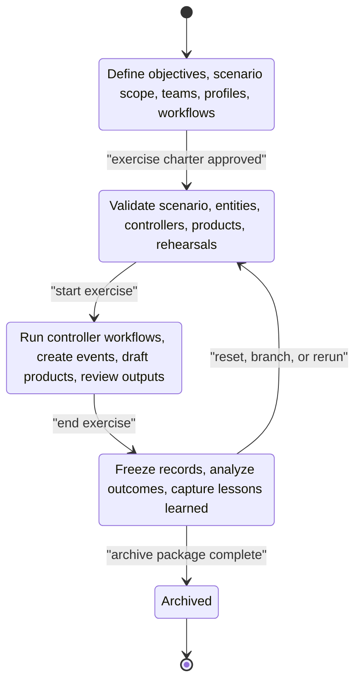
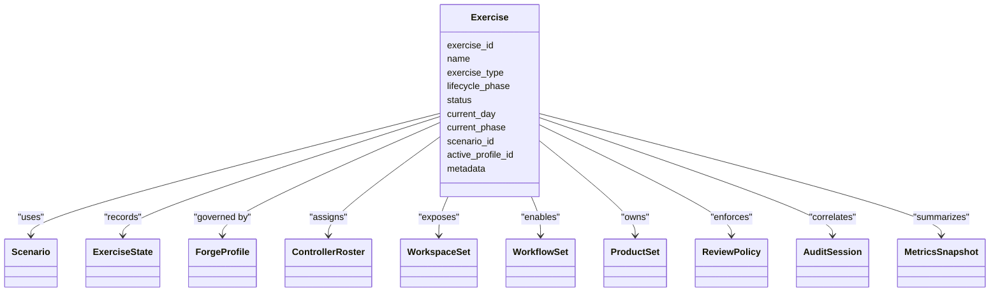
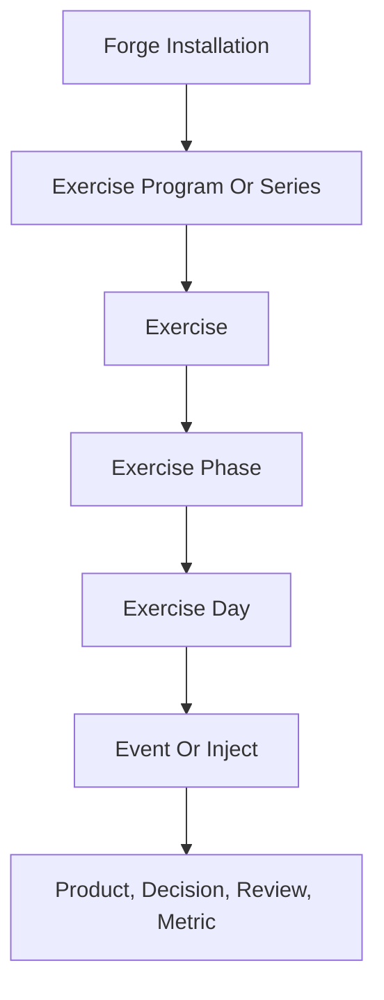
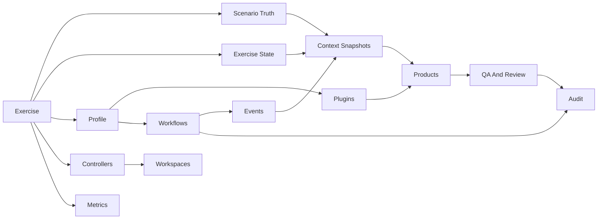
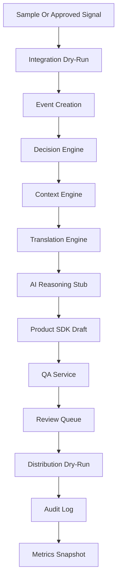
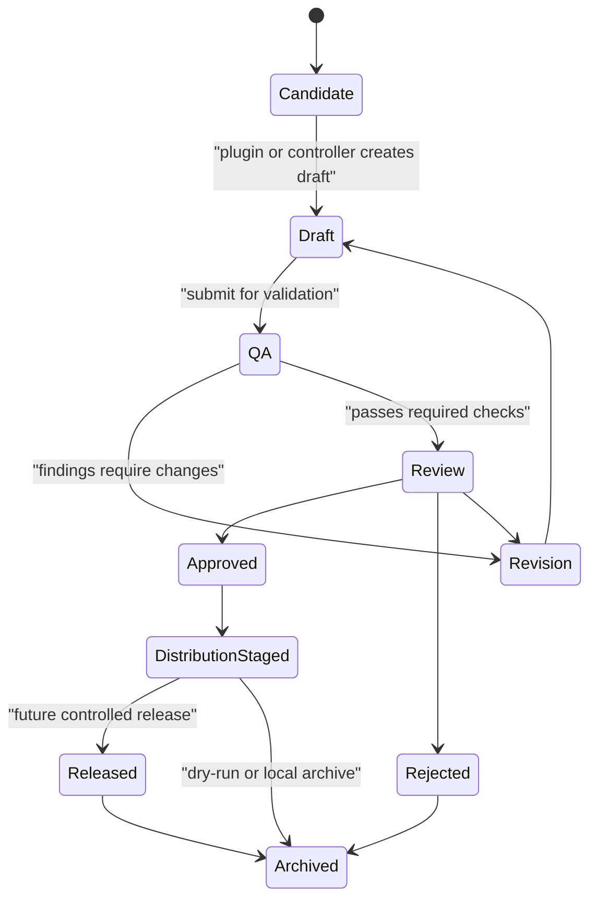

# Exercise Lifecycle

The Exercise Lifecycle is the central organizing model for Forge Studio. It defines how Forge binds scenario truth, controller activity, workflows, profiles, plugins, products, audit records, and operational state into one controlled training event.

This document is a conceptual foundation. It does not define implementation code, database schemas, external integrations, or production authentication behavior.

## What An Exercise Is

An Exercise is the top-level operational container for a controlled training event in Forge.

It is the object that answers:

```text
What exercise are we supporting, what phase is it in, who is controlling it,
what scenario truth applies, what workflows are active, and what products,
decisions, reviews, metrics, and audit records belong to it?
```

An Exercise is not only a scenario. It is not only a workspace. It is not only a profile. It is the governed container that connects those concepts.

| Concept | Relationship To Exercise |
| --- | --- |
| Scenario | Defines the fictional world, assumptions, objectives, constraints, and exercise truth. |
| Exercise State | Records current day, phase, tempo, escalation, situation state, and operational posture. |
| Profile | Adapts Forge behavior to the venue, exercise family, unit, terminology, plugins, and workflows. |
| Workspace | Provides role-specific user interfaces into the active Exercise. |
| Controller | Acts within the Exercise through assigned roles, permissions, queues, and responsibilities. |
| Workflow | Runs deterministic controller and product processes inside the Exercise boundary. |
| Product | Belongs to an Exercise and carries source, scenario, context, profile, QA, review, and release metadata. |
| Plugin | Adds governed product or workflow capability that may be enabled for the Exercise. |
| Audit And Metrics | Preserve traceability, accountability, health, volume, latency, and decision records for the Exercise. |

## Core Principles

- Exercise-first navigation: Forge Studio should orient users around the selected Exercise before showing tools, queues, products, or search results.
- Scenario-controlled execution: every event, product, translation, and AI-assisted draft must be evaluated against exercise truth.
- Lifecycle-aware workflow: available actions should depend on whether the Exercise is being planned, prepared, executed, or assessed.
- Human-controlled release: controllers and reviewers retain authority over products that enter exercise play.
- Audit-ready by default: decisions, approvals, rejections, drafts, distribution actions, profile selections, and automation activity should preserve traceable records.
- Modular without fragmentation: services remain separate, but the Exercise model provides the shared operational frame.

## Exercise Lifecycle

Forge recognizes four primary lifecycle phases:

1. Planning
2. Preparation
3. Execution
4. Assessment



`Archived` is a future retention state rather than a fifth operating phase. It represents completed records, frozen outputs, and historical search.

## Planning Phase

Planning defines why the Exercise exists and what Forge must be ready to support.

Primary goals:

- Define exercise purpose, training audience, objectives, and scope.
- Identify exercise type, venue, schedule, and major control milestones.
- Select or draft the scenario family and profile direction.
- Establish controller cells, review authority, product needs, and release constraints.
- Identify source families, knowledge references, entity requirements, and product plugins.
- Decide what workflow modules are required for the Exercise.
- Define assessment criteria and success indicators before execution begins.

Planning outputs:

| Output | Description |
| --- | --- |
| Exercise Charter | Mission, objectives, audience, dates, constraints, and governance notes. |
| Scenario Plan | Scenario family, baseline assumptions, major events, control measures, and objectives. |
| Profile Plan | Candidate profile, dictionaries, terminology, plugins, workflow paths, and approval policy. |
| Controller Plan | Roles, cells, assignments, escalation paths, and review authority. |
| Product Plan | Expected product types, templates, QA rules, review queues, and distribution approach. |
| Workflow Plan | Planned workflows for intake, product generation, review, distribution, metrics, and assessment. |
| Assessment Plan | Objective coverage rules, performance measures, audit expectations, and after-action reporting needs. |

Planning phase user experience:

```text
+--------------------------------------------------------------------------+
| Forge > Exercise Planning                                                |
+----------------------+---------------------------------------------------+
| Exercise Charter     | Objectives                                        |
| Scenario Plan        | - Training audience                               |
| Profile Plan         | - Scenario boundaries                             |
| Controller Plan      | - Product families                                |
| Product Plan         | - Assessment criteria                             |
| Workflow Plan        |                                                   |
+----------------------+---------------------------------------------------+
| Open Items: profile selection, controller roster, plugin approval         |
+--------------------------------------------------------------------------+
```

## Preparation Phase

Preparation turns a planned Exercise into an executable Forge workspace.

Primary goals:

- Load and validate scenario facts, assumptions, objectives, constraints, and control measures.
- Load knowledge references, entity records, translation dictionaries, and profile components.
- Configure controller workspaces, role assignments, permissions, queues, and notification rules.
- Enable product plugins and validate their required context, templates, QA expectations, and governance metadata.
- Configure workflows for daily products, breaking injects, review routing, dry-run distribution, metrics, and audit.
- Dry-run end-to-end pipelines with safe sample data.
- Seed baseline events, exercise state, timeline markers, and initial operating picture.
- Rehearse controller procedures before execution starts.

Preparation outputs:

| Output | Description |
| --- | --- |
| Active Profile | The governed profile selected for execution, including enabled services, plugins, dictionaries, and workflows. |
| Validated Scenario | Scenario material ready for context assembly and decision checks. |
| Entity Baseline | Units, organizations, locations, platforms, actors, and relationships approved for exercise use. |
| Workspace Configuration | Mission Control, controller workspaces, review queues, search scopes, and dashboards. |
| Controller Roster | Assigned users, service accounts, system actors, roles, permissions, and review responsibilities. |
| Product Configuration | Enabled product plugins, templates, QA rules, and review gates. |
| Dry-Run Results | Pipeline rehearsal status, validation findings, missing data, and readiness notes. |

Preparation phase user experience:

```text
+--------------------------------------------------------------------------+
| Forge > Exercise Preparation                         Status: Not Ready   |
+----------------------+----------------------+---------------------------+
| Readiness Checklist  | Scenario Validation  | Controller Roster         |
| [ ] Profile active   | Facts: 48 valid      | EXDIR: assigned           |
| [ ] Entities loaded  | Objectives: 12 valid | INTEL: assigned           |
| [ ] Plugins checked  | Gaps: 3              | REVIEW: pending           |
| [ ] Dry-run passed   |                      |                           |
+----------------------+----------------------+---------------------------+
| Last Dry-Run: failed at product QA - missing required source reference    |
+--------------------------------------------------------------------------+
```

## Execution Phase

Execution is the live operating period of the Exercise.

Primary goals:

- Maintain the current operational picture for Exercise Control.
- Process sample or approved source events through deterministic intake, context, translation, and product workflows.
- Create exercise events, decisions, context snapshots, and product drafts.
- Route drafts through QA and human review before distribution.
- Track controller health, review queues, active events, activity feed, notifications, audit records, and metrics.
- Preserve scenario boundaries and prevent uncontrolled real-world leakage into exercise fiction.
- Provide role-specific workspaces that minimize clicks and maximize situational awareness.

Execution outputs:

| Output | Description |
| --- | --- |
| Exercise Events | Scenario-aligned events with source references, entities, severity, status, and timeline position. |
| Context Snapshots | Deterministic bundles of scenario, state, entities, knowledge, decisions, and events. |
| Security Decisions | Allow or deny records for role-based actions and governed operations. |
| Product Drafts | Plugin-generated or manually prepared products with traceability and metadata. |
| QA Findings | Validation results, missing fields, leakage warnings, confidence issues, and required corrections. |
| Review Records | Assignments, approvals, rejections, revisions, notes, and controller decisions. |
| Distribution Records | Dry-run or local distribution actions after approval. |
| Audit And Metrics | Complete operational records for after-action analysis and system health. |

Execution phase user experience:

```text
+--------------------------------------------------------------------------------+
| Exercise: Forge Demo 25-01 | Day 03 | Phase: Execution | Profile: Joint-EX     |
+----------------+---------------------------+-----------------------------------+
| Navigation     | Mission Control           | Review And Alerts                 |
| Mission Ctrl   | Timeline + Active Events  | Pending approvals: 7              |
| Intake         | Controller health         | Critical alerts: 1                |
| Intel WS       | Products today            | QA failures: 2                    |
| Review Queue   | Metrics snapshot          | Activity feed                     |
| Search         |                           |                                   |
+----------------+---------------------------+-----------------------------------+
| Current Focus: real-world signal staged for scenario translation                |
+--------------------------------------------------------------------------------+
```

## Assessment Phase

Assessment freezes the Exercise record and turns operational activity into reviewable lessons.

Primary goals:

- Freeze exercise state, products, review records, audit logs, metrics snapshots, and major decisions.
- Analyze objective coverage, product volume, review latency, QA failure patterns, controller workload, and timeline execution.
- Identify scenario drift, profile gaps, plugin issues, workflow friction, missing abstractions, and training value.
- Prepare after-action material for exercise leadership and future Forge improvements.
- Record profile, plugin, workflow, and documentation changes needed before the next Exercise.

Assessment outputs:

| Output | Description |
| --- | --- |
| Assessment Snapshot | Frozen exercise state, timeline, products, review outcomes, metrics, and audit references. |
| Objective Coverage Report | Mapping from exercise objectives to events, decisions, products, and observed activity. |
| Product Review Report | Product counts, approval rates, revision reasons, QA findings, and distribution status. |
| Controller Activity Review | Workload, response times, collaboration patterns, and queue pressure. |
| Lessons Learned | Scenario, profile, plugin, workflow, UI, and governance improvements. |
| Archive Package | Future packaged record for retention, search, export, and historical reuse. |

Assessment phase user experience:

```text
+--------------------------------------------------------------------------+
| Forge > Exercise Assessment                         Status: Frozen       |
+----------------------+----------------------+---------------------------+
| Objective Coverage   | Product Outcomes     | Controller Activity       |
| 12 / 14 covered      | 87 drafts            | Review median: 11 min     |
| 2 gaps               | 64 approved          | INTEL workload: high      |
|                      | 9 rejected           | EXCON workload: normal    |
+----------------------+----------------------+---------------------------+
| Lessons: profile mapping gaps, missing media workflow, QA source friction |
+--------------------------------------------------------------------------+
```

## Exercise Object Model

The Exercise object should remain compact enough to be shared across services while rich enough to anchor navigation, access control, workflow execution, and audit context.

| Field | Purpose |
| --- | --- |
| `exercise_id` | Stable unique identifier for the Exercise. |
| `name` | Human-readable exercise name. |
| `exercise_type` | Category such as service-level training exercise, command post exercise, rehearsal, or tabletop. |
| `lifecycle_phase` | Planning, Preparation, Execution, Assessment, or future Archived state. |
| `status` | Draft, configuring, ready, active, paused, complete, frozen, archived, or other controlled status. |
| `description` | Short operational description. |
| `start_date` / `end_date` | Planned or actual exercise dates. |
| `current_day` | Current exercise day during preparation or execution. |
| `current_phase` | Scenario phase or operational phase within the Exercise. |
| `current_tempo` | Normal, elevated, surge, pause, or other Exercise State Engine value. |
| `escalation_level` | Current scenario escalation value used by context and decision workflows. |
| `scenario_id` | Scenario baseline associated with the Exercise. |
| `active_profile_id` | Profile selected to govern terminology, services, plugins, workflows, and policy. |
| `workspace_ids` | Workspaces exposed for this Exercise. |
| `controller_roster_id` | Controller assignments, roles, review authority, and shift information. |
| `objective_ids` | Training objectives and assessment anchors. |
| `enabled_plugin_ids` | Product and workflow plugins approved for use. |
| `enabled_workflow_ids` | Workflows allowed to run in the Exercise context. |
| `review_policy_id` | Review gates, approvers, routing rules, and release authority. |
| `distribution_policy_id` | Dry-run, local, archive, or future distribution handling rules. |
| `audit_session_id` | Audit session or correlation scope for exercise activity. |
| `metadata` | Controlled extension field for tags, owners, sensitivity, venue, series, branch, and notes. |
| `created_at` / `updated_at` | Audit-ready timestamps. |



## Exercise Hierarchy

Forge Studio should support a hierarchy that can grow from a single local demonstration into multi-event programs.



| Level | Purpose |
| --- | --- |
| Forge Installation | The local or hosted Forge environment, configuration, services, plugins, and users. |
| Exercise Program Or Series | Optional grouping for recurring events, annual exercises, venue cycles, or campaign-style training. |
| Exercise | The central operational container for one controlled training event. |
| Exercise Phase | Planning, Preparation, Execution, Assessment, plus scenario-specific phases inside Execution. |
| Exercise Day | Time-boxed operational slices used by Mission Control, timelines, reports, and metrics. |
| Event Or Inject | Scenario-aligned occurrence that may drive decisions, products, review activity, and timeline changes. |
| Product, Decision, Review, Metric | Auditable records generated by workflows and controller activity. |

## Relationships



Important relationship rules:

- Scenario truth is referenced by the Exercise; it should not be rewritten casually during execution.
- Exercise State records the current operational posture without replacing the scenario baseline.
- Profiles govern terminology, plugin selection, workflow selection, and policy for the Exercise.
- Workspaces are role-aware views into the same Exercise record.
- Controllers act within the Exercise through roles, permissions, review queues, and activity records.
- Workflows run within the Exercise context and should record stage results, failures, and decisions.
- Products must carry enough references to reconstruct source material, context, profile, plugin version, QA findings, and review decisions.
- Audit and metrics should observe all lifecycle phases, not only execution.

## Workspace Mapping

Each Forge Studio workspace is a role-aware view into the selected Exercise.

| Workspace | Primary Phase | Primary Users | Exercise Scope |
| --- | --- | --- | --- |
| Mission Control | Preparation, Execution, Assessment | Exercise Director, EXCON, controllers, reviewers | Whole-exercise status, timeline, alerts, queues, health, metrics, and activity. |
| Exercise Planning | Planning | Exercise Director, administrators, senior controllers | Charter, objectives, scenario plan, profile plan, controller plan, product plan, workflow plan. |
| Exercise Preparation | Preparation | Administrators, EXCON, controller leads | Readiness checks, validation, dry-runs, roster, plugin readiness, workflow readiness. |
| Intelligence Controller | Execution | Intelligence Controller, Intelligence Chief | Real-world signals, scenario translation, context, entity lookup, draft intelligence products. |
| EXCON Controller | Execution | EXCON Controller, Exercise Director | Active events, injects, decisions, timeline control, escalation, controller coordination. |
| Media Controller | Execution | Media Controller, reviewers | News, social, public affairs, narrative products, review status, release staging. |
| Review Queue | Preparation, Execution, Assessment | Reviewers, approvers, Exercise Director | QA findings, assignments, approval, rejection, revision, release readiness. |
| Scenario Management | Planning, Preparation | Scenario owners, administrators | Scenario facts, objectives, control measures, constraints, and validation. |
| Assessment | Assessment | Exercise Director, reviewers, analysts | Objective coverage, product outcomes, metrics, audit review, lessons learned. |
| Administration | All phases | Administrators, system actors | Profiles, plugins, roles, permissions, configuration, audit visibility, system status. |

## Controller Mapping

Controllers are assigned to an Exercise, not only to the platform. Their permissions, workspaces, queues, and notifications should be scoped by current Exercise and lifecycle phase.

| Controller Role | Primary Responsibilities | Default Workspaces |
| --- | --- | --- |
| Administrator | Configure Exercise access, profiles, plugins, service settings, and system actors. | Administration, Exercise Preparation, Mission Control |
| Exercise Director | Own exercise intent, major decisions, phase transitions, and final release authority. | Mission Control, Exercise Planning, Assessment, Review Queue |
| EXCON Controller | Manage exercise flow, injects, timeline updates, coordination, and scenario control. | Mission Control, EXCON Controller, Review Queue |
| Intelligence Controller | Convert real-world signals into scenario-consistent intelligence context and products. | Intelligence Controller, Mission Control, Search |
| Media Controller | Prepare media, public affairs, narrative, and social-style products under review control. | Media Controller, Review Queue, Mission Control |
| Reviewer | Check quality, scenario fidelity, source traceability, and approval readiness. | Review Queue, Mission Control, Search |
| Viewer | Observe exercise status, products, activity, and approved records without changing state. | Mission Control, Search, Assessment |
| System | Run deterministic local workflows, dry-runs, automation triggers, metrics, and audit records. | No human workspace; visible through audit and metrics. |

## Workflow Mapping

Workflows should be enabled by Exercise phase so controllers see the right actions at the right time.

| Phase | Workflow Families |
| --- | --- |
| Planning | Exercise charter drafting, objective mapping, scenario planning, profile selection, plugin planning, workflow planning. |
| Preparation | Scenario validation, entity validation, profile activation, plugin validation, controller roster validation, dry-run pipeline, readiness review. |
| Execution | Signal intake, event creation, decision evaluation, context assembly, translation, AI reasoning stub, product drafting, QA, review, distribution dry-run, audit, metrics. |
| Assessment | State freeze, product outcome analysis, objective coverage, controller workload analysis, audit review, lessons learned, archive package preparation. |



## Product Mapping

Products belong to an Exercise and should move through a controlled lifecycle.



Product records should reference:

- Exercise ID
- Event or inject ID when applicable
- Scenario and Exercise State snapshot
- Profile ID and version
- Plugin ID and version
- Source references
- Knowledge and entity references
- Training objectives
- QA findings
- Review decisions
- Distribution records
- Audit correlation ID
- Metadata and classification or sensitivity markers when defined by future policy

## Profile Mapping

Profiles are selected and governed through the Exercise Lifecycle.

| Phase | Profile Behavior |
| --- | --- |
| Planning | Candidate profiles are compared against venue, scenario, unit, terminology, plugin, and workflow needs. |
| Preparation | One active profile is selected, loaded, validated, and used to enable dictionaries, plugins, workflows, and paths. |
| Execution | Profile changes should be controlled, audited, and limited to authorized users because they affect translation, products, and review policy. |
| Assessment | Profile gaps and improvement notes are captured for future profile versioning. |

Profile-controlled values should include dictionaries, approved entity mappings, terminology, plugin selection, workflow paths, template paths, QA expectations, review expectations, and scenario-specific governance notes.

## Plugin Mapping

Plugins add capability to an Exercise without changing Forge Core.

| Plugin Type | Exercise Relationship |
| --- | --- |
| Product Plugin | Defines product families, required context, templates, metadata, supported formats, and governance expectations. |
| Workflow Plugin | Future packaging for reusable phase-aware workflow sequences. |
| Profile Plugin | Future packaging for venue, unit, or exercise family configuration. |
| QA Plugin | Future extension for scenario-specific, venue-specific, or product-specific validation checks. |
| Export Plugin | Future extension for approved output packages, briefings, reports, archives, or local files. |
| Provider Plugin | Future extension for bounded AI, reasoning, or offline provider implementations. |

Plugin rules:

- Plugins should be enabled explicitly by Exercise or active profile.
- Product plugins should remain behind QA and Review Queue gates.
- Plugins should not perform hidden external calls.
- Plugin versions should be recorded on products, workflows, audit records, and assessment findings.
- Plugin health should be visible during Preparation and Execution.

## Navigation Implications

Forge Studio navigation should begin with Exercise context.

Recommended global frame:

```text
+--------------------------------------------------------------------------------+
| Forge | Exercise: [Selector] | Day | Phase | Profile | Search | Alerts | User   |
+--------------------------------------------------------------------------------+
| Mission Control | Intake | Exercise Picture | Production | Review | Search     |
+--------------------------------------------------------------------------------+
| Breadcrumb: Forge > Program > Exercise > Workspace > Object                    |
+--------------------------------------------------------------------------------+
| Workspace content scoped to selected Exercise                                  |
+--------------------------------------------------------------------------------+
```

Navigation rules:

- The Exercise selector should be visible from all major Forge Studio screens.
- The active lifecycle phase should be visible in the global frame.
- Phase transitions should be controlled actions limited to authorized roles.
- Search should default to the current Exercise while allowing authorized cross-exercise search in the future.
- Workspaces should be grouped under the selected Exercise rather than presented as disconnected tools.
- Mission Control should be the default execution landing screen.
- Assessment should become the default landing screen after the Exercise is frozen.
- Products, events, decisions, reviews, metrics, and audit records should all show their Exercise association.
- Empty states should explain what the current phase expects, such as missing scenario validation in Preparation or no approved products in Execution.

## Future Expansion

The Exercise model should leave room for:

- Multi-exercise programs and recurring exercise series.
- Exercise templates for common venues, units, training audiences, and product sets.
- Branch, sequel, and reset support for scenario variants.
- Cross-exercise search and lessons-learned reuse.
- Versioned exercise baselines for scenario, profile, workflow, and plugin changes.
- Real authentication and external identity providers when Forge leaves local foundation status.
- Persistent storage, database-backed registries, and archive retention policy.
- Geospatial exercise map layers.
- Simulation or constructive training system integrations.
- Live source connectors after governance and safety controls are mature.
- AAR export packages and leadership-ready assessment products.
- Federated controller workspaces across distributed exercise control cells.
- Exercise package import and export for repeatable setup.

## Conceptual Contract

Future Forge work should treat Exercise as the organizing context for:

- Service execution
- Studio navigation
- Controller permissions
- Workflow availability
- Product traceability
- Profile and plugin enablement
- Review authority
- Audit correlation
- Metrics reporting
- Assessment and archive behavior

This keeps Forge modular at the service layer while giving controllers a coherent operational model: one Exercise, one controlled lifecycle, many specialized services working inside that boundary.
