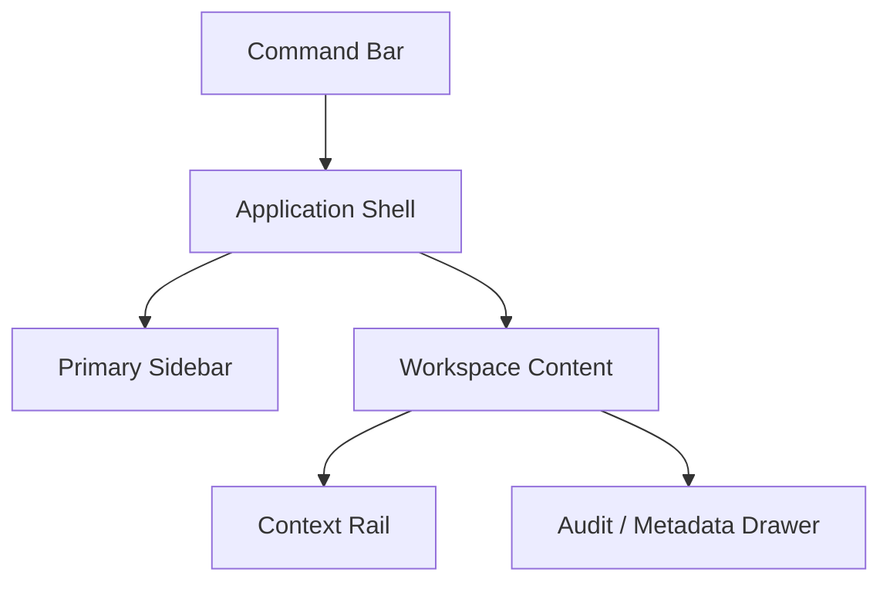
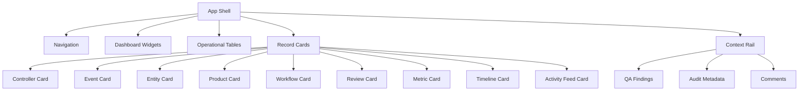

# Forge Studio Design System

Forge Studio is the future command-center application for Project Forge. This design system defines the visual language, layout rules, interaction states, and reusable component specifications every future Forge Studio interface should follow.

This is a documentation-only design specification. It does not implement a frontend, component library, CSS framework, route structure, or runtime behavior.

## Design Intent

Forge Studio should feel like a modern exercise control room: focused, information-dense, disciplined, and trustworthy. The interface should support high-tempo controller work without drifting into consumer-app styling, marketing pages, decorative gradients, or playful visual treatment.

The design language should be:

- Command-center focused
- Military and enterprise aligned
- Calm under pressure
- Dense but readable
- Auditable and traceable
- Role-aware
- Dark-theme native
- Accessible by default

## Brand Identity

| Element | Specification |
| --- | --- |
| Product name | Forge Studio |
| Parent platform | Forge |
| Tagline alignment | Every Event. Every Inject. Every Exercise. |
| Visual posture | Operational, controlled, precise, and quiet. |
| Logo use | Use the Forge metallic shield logo from `assets/forge-logo.png`. The legacy placeholder is retained only as a historical asset. |
| Voice | Direct, professional, concise, controller-centered. |
| Avoid | Consumer social styling, oversized hero layouts, playful illustrations, heavy gradients, glassmorphism, decorative blobs, and theatrical animations. |

Brand rules:

- Show the Forge mark in the app shell, workspace selector, and sign-in or future launch surfaces.
- Keep the logo secondary to the active workspace in operational screens.
- Do not use the logo as a watermark behind work content.
- Use direct operational labels: "Review Queue", "Timeline", "Audit Log", "Metrics", "Products".

## Color Palette

Dark theme is primary. Light theme is secondary and should preserve the same semantic colors, spacing, density, and component structure.

### Dark Theme Tokens

| Token | Hex | Use |
| --- | --- | --- |
| `color-bg-base` | `#0B0F14` | Application background |
| `color-bg-surface` | `#111821` | Panels, sidebars, table bodies |
| `color-bg-elevated` | `#17212B` | Cards, popovers, drawers |
| `color-bg-inset` | `#080C10` | Code, metadata wells, timeline lanes |
| `color-border-subtle` | `#243140` | Default borders and separators |
| `color-border-strong` | `#3A4A5C` | Active regions and selected rows |
| `color-text-primary` | `#E6EDF3` | Primary text |
| `color-text-secondary` | `#A9B6C3` | Secondary text |
| `color-text-muted` | `#738292` | Metadata, timestamps |
| `color-accent-command` | `#4EA1D3` | Primary focus, selected navigation, command actions |
| `color-accent-intel` | `#65B891` | Intelligence, source-backed confidence |
| `color-accent-review` | `#D6A84F` | Review, pending action, caution |
| `color-accent-critical` | `#D65A5A` | Critical, deny, failed, destructive |
| `color-accent-approved` | `#54A36A` | Approved, succeeded |
| `color-accent-neutral` | `#8793A1` | Draft, inactive, placeholder |

### Light Theme Tokens

| Token | Hex | Use |
| --- | --- | --- |
| `color-bg-base` | `#F5F7FA` | Application background |
| `color-bg-surface` | `#FFFFFF` | Panels, sidebars, table bodies |
| `color-bg-elevated` | `#F0F4F8` | Cards, popovers, drawers |
| `color-bg-inset` | `#E8EEF4` | Code, metadata wells, timeline lanes |
| `color-border-subtle` | `#D3DCE6` | Default borders and separators |
| `color-border-strong` | `#AAB8C6` | Active regions and selected rows |
| `color-text-primary` | `#17212B` | Primary text |
| `color-text-secondary` | `#405064` | Secondary text |
| `color-text-muted` | `#667589` | Metadata, timestamps |
| `color-accent-command` | `#1F6F9E` | Primary focus, selected navigation, command actions |
| `color-accent-intel` | `#2E7D55` | Intelligence, source-backed confidence |
| `color-accent-review` | `#9A6A16` | Review, pending action, caution |
| `color-accent-critical` | `#B42318` | Critical, deny, failed, destructive |
| `color-accent-approved` | `#287A3E` | Approved, succeeded |
| `color-accent-neutral` | `#5E6B78` | Draft, inactive, placeholder |

### Status Colors

Color must never be the only state indicator. Pair every status color with a label and icon.

| State | Color Token | Label Examples |
| --- | --- | --- |
| Succeeded | `color-accent-approved` | Succeeded, Approved, Released |
| Pending | `color-accent-review` | Pending, Awaiting Review, Queued |
| Warning | `color-accent-review` | Warning, Needs Attention |
| Failed | `color-accent-critical` | Failed, Rejected, Denied |
| Critical | `color-accent-critical` | Critical, Blocking, Escalate |
| Draft | `color-accent-neutral` | Draft, Staged, Placeholder |
| Running | `color-accent-command` | Running, Processing |
| Informational | `color-accent-intel` | Source-Backed, Context Ready |

## Typography

Forge Studio typography should prioritize scan speed, numeric clarity, and controlled hierarchy.

| Token | Recommendation | Use |
| --- | --- | --- |
| `font-sans` | Inter, Segoe UI, system sans-serif | Primary interface text |
| `font-mono` | IBM Plex Mono, SFMono-Regular, Consolas, monospace | IDs, timestamps, correlation IDs, code-like metadata |
| `font-size-xs` | 12px | Metadata, labels, table secondary text |
| `font-size-sm` | 13px | Dense controls, table cells |
| `font-size-md` | 14px | Body text, forms, cards |
| `font-size-lg` | 16px | Panel headings |
| `font-size-xl` | 20px | Page titles |
| `font-size-display` | 24px | Dashboard title only |

Rules:

- Do not scale font size with viewport width.
- Letter spacing should remain `0`.
- Use monospace for identifiers such as event IDs, product IDs, review IDs, service names, and correlation IDs.
- Keep dashboard headings compact. Reserve display size for workspace-level titles only.
- Use title case for major headings and sentence case for field labels, empty states, and helper text.

## Iconography

Use a consistent outline icon set in the future frontend. Lucide is the preferred candidate because it covers enterprise application actions cleanly.

Icon rules:

- Use icons inside buttons for common tools: search, filter, refresh, approve, reject, assign, download, archive, settings, timeline, audit, metrics.
- Pair unfamiliar icons with visible text or tooltip text.
- Do not use custom decorative icons when a standard command icon exists.
- Use status icons consistently: check, clock, alert triangle, x circle, shield, activity, file, users.
- Icons should be 16px in tables and dense controls, 20px in nav and cards, and 24px only for empty states.

## Layout System

Forge Studio should use a persistent app shell.



Layout rules:

- App shell fills the viewport.
- Command bar is fixed at top and remains visible.
- Primary sidebar is persistent on desktop and collapsible on tablet.
- Content area should favor split panes, tables, and detail panels.
- Context rail is optional and should hold QA findings, audit metadata, comments, or related objects.
- Do not place UI cards inside other cards.
- Page sections should be unframed layouts or full-width bands. Use cards for repeated objects, widgets, and bounded detail panels.

## Grid System

| Token | Value | Use |
| --- | --- | --- |
| `space-1` | 4px | Tight icon and label gaps |
| `space-2` | 8px | Control gaps, compact padding |
| `space-3` | 12px | Dense card padding |
| `space-4` | 16px | Panel padding |
| `space-6` | 24px | Major region gaps |
| `space-8` | 32px | Dashboard section gaps |

Grid rules:

- Use 8px as the base spacing unit.
- Use 12-column grids for dashboards and admin screens.
- Use 2-pane layouts for review, product drafting, and event detail.
- Use 3-pane layouts only when the third pane is narrow and operationally necessary.
- Keep primary data tables full-width.
- Use fixed heights for command bars, sidebars, table rows, metric cards, and timeline lanes to prevent layout shift.

Recommended desktop dimensions:

| Element | Size |
| --- | --- |
| Command bar | 56px high |
| Sidebar expanded | 248px wide |
| Sidebar collapsed | 64px wide |
| Context rail | 320px to 420px wide |
| Table row | 44px default, 36px compact |
| Card radius | 6px default, 8px maximum |

## Card Design

Cards should read as operational records, not marketing tiles.

Card rules:

- Border radius: 6px default, 8px maximum.
- Use a 1px border with subtle background contrast.
- Avoid heavy shadows. Use elevation through border and background only.
- Put status, priority, and timestamp in predictable positions.
- Keep card headers compact.
- Use monospace IDs in metadata rows.
- Avoid large images inside operational cards unless a future product explicitly requires media preview.

Card anatomy:

```text
+------------------------------------------------+
| Title / Identifier                  Status Chip |
| Secondary context                              |
| Metadata row: owner / time / profile / service |
| Primary metric or summary                      |
| Actions: icon buttons or compact text buttons  |
+------------------------------------------------+
```

## Tables

Tables are the default pattern for queues, registries, audit logs, search results, metrics, products, entities, and configuration.

Table rules:

- Use sticky headers for long tables.
- Support column sorting where data has meaningful ordering.
- Use compact filters above the table, not hidden deep inside menus.
- Keep status columns near the left side for scanning.
- Use monospace for IDs and timestamps.
- Provide row selection, row open, and keyboard navigation.
- Avoid zebra striping if borders and hover states already provide enough separation.
- Never rely on color alone for severity or status.

Default columns by table family:

| Table | Required Columns |
| --- | --- |
| Review Queue | Status, priority, product, owner, reviewer, QA, age, actions |
| Products | Status, type, title, plugin, profile, source count, updated, owner |
| Events | Severity, type, title, exercise day, phase, entities, status |
| Entities | Name, category, affiliation, status, aliases, updated |
| Audit | Time, actor, action, service, severity, target, correlation ID |
| Metrics | Metric, value, trend, service, tags, snapshot time |

## Buttons

Button hierarchy:

| Button | Use |
| --- | --- |
| Primary | One dominant page action, such as submit for review. |
| Secondary | Routine actions, such as assign, refresh, filter, open. |
| Tertiary | Low-emphasis actions in dense panels. |
| Icon | Tool actions with recognizable symbols. |
| Danger | Reject, deny, remove, destructive configuration changes. |

Rules:

- Use icon buttons for common commands when the icon is familiar.
- Use text or icon-plus-text for approval, rejection, escalation, and review decisions.
- Primary buttons should be rare and contextual.
- Danger actions must require confirmation when irreversible or audit-significant.
- Disabled buttons must include accessible explanation through tooltip or helper text.

## Forms

Forms should be explicit, compact, and audit-aware.

Form rules:

- Group fields by operational meaning: source, scenario, product, review, distribution, metadata.
- Use labels above fields for complex forms.
- Use inline validation near the affected field.
- Preserve typed values when validation fails.
- Mark required fields clearly with text, not color alone.
- Use selects for controlled vocabularies and free text only where operational notes are expected.
- Confirmation dialogs are required for approve, reject, escalate, distribution, role changes, and profile activation.

## Navigation

Navigation should mirror Forge Studio workspaces.

Primary navigation groups:

- Dashboard
- Intake
- Exercise Picture
- Production
- Quality And Review
- Operations
- Administration

Navigation states:

- Default
- Hover
- Active
- Attention
- Disabled
- Permission denied

Rules:

- Active nav item uses accent border, icon, and text weight.
- Attention badges should be numeric for queues and severity-coded for alerts.
- Do not hide unavailable areas without explanation. Show disabled or permission-denied affordance when helpful.

## Sidebars

Sidebars should support fast orientation and quick movement.

Primary sidebar:

- Workspace-scoped navigation
- Collapsible on medium screens
- Icon and text labels when expanded
- Icon-only with tooltips when collapsed

Context sidebar:

- Shows related object metadata, comments, QA findings, audit entries, or linked entities.
- Should be resizable on desktop.
- Should collapse into tabs on small screens.

## Status Indicators

Status indicators must combine:

- Icon
- Text label
- Semantic color
- Optional timestamp or owner

Recommended indicators:

| Indicator | Icon Intent | Example Label |
| --- | --- | --- |
| Success | Check | Approved |
| Running | Activity | Running |
| Pending | Clock | Awaiting Review |
| Warning | Alert triangle | Needs Attention |
| Failed | X circle | QA Failed |
| Denied | Shield or lock | Access Denied |
| Draft | File | Draft |

## Notification Styles

Notifications should be operational tasks, not decorative messages.

Notification anatomy:

```text
+------------------------------------------------+
| Severity icon  Notification title        Time  |
| Actionable summary                             |
| Target: Product / Event / Review / Workflow    |
| Primary action             Secondary action    |
+------------------------------------------------+
```

Rules:

- Critical notifications remain visible until acknowledged or resolved.
- Routine notifications can collapse into the notification center.
- Toasts are for transient confirmations only.
- Notifications that require review action should link directly to the object.
- Use the same severity tokens as QA, audit, and activity feed.

## Timeline Styling

Timeline is a controller tool, not a decorative graphic.

Timeline lanes:

- Exercise phase
- Events
- Products
- Reviews
- Distribution
- Audit markers

Timeline rules:

- Use horizontal lanes on desktop.
- Use a vertical list on mobile.
- Show planned and actual times distinctly.
- Mark blocked items with icon, label, and critical color.
- Allow filtering by day, product type, controller cell, severity, and status.
- Provide a table/list fallback for accessibility.

## Dashboard Widgets

Dashboard widgets should summarize operational state.

Widget rules:

- Use compact cards with fixed heights.
- Each widget must have a title, timestamp or freshness marker, and link to detail.
- Metrics must include units and comparison context when available.
- Avoid decorative charts that do not support a controller decision.

Widget families:

- Exercise state
- Review pressure
- Product throughput
- QA risk
- Timeline next actions
- Pipeline health
- Metrics snapshot
- Activity feed

## Empty States

Empty states should be quiet and useful.

An empty state should include:

- Plain title
- One-sentence explanation
- Primary next action when allowed
- Optional secondary link to docs or configuration

Examples:

| Surface | Empty State |
| --- | --- |
| Review Queue | No products are awaiting review. |
| Intake | No source signals are staged for this workspace. |
| Search | No local results matched the current filters. |
| Timeline | No timeline items are scheduled for this exercise day. |
| Metrics | No metrics snapshot has been captured yet. |

## Loading States

Loading states should preserve layout.

Rules:

- Use skeleton rows for tables.
- Use skeleton blocks for cards and widgets.
- Show service or stage name when a workflow is running.
- Avoid spinners as the only loading indicator for long operations.
- Preserve previous data when refreshing unless it would be misleading.

## Error States

Error states should explain what failed and what can be done.

Error anatomy:

- Clear title
- Affected service or object
- Failure message
- Status or code when available
- Retry or safe next action
- Link to audit entry or pipeline stage result when available

Common error classes:

- Validation failed
- Permission denied
- Service unavailable
- Pipeline stage failed
- QA blocked
- Configuration invalid
- Distribution dry-run failed
- Search unavailable

## Reusable UI Components

### Controller Cards

Purpose: Show controller identity, role, availability, assignments, and authority.

Required fields:

- Controller name
- Role
- Cell or desk
- Availability
- Active assignments
- Review authority
- Last action

Visual rules:

- Role chip in header.
- Assignment count near top-right.
- Availability shown with text and icon.
- Recent decision as muted metadata.

### Event Cards

Purpose: Summarize exercise events and source-derived signals.

Required fields:

- Event title
- Event type
- Severity
- Exercise day and phase
- Related entities
- Source reference count
- Status

Visual rules:

- Severity indicator on left edge.
- Exercise day and phase in monospace metadata.
- Entity chips limited to three visible chips before overflow.

### Entity Cards

Purpose: Represent scenario actors, units, organizations, locations, platforms, and relationships.

Required fields:

- Entity name
- Category
- Affiliation
- Status
- Aliases
- Related events

Visual rules:

- Affiliation chip in header.
- Category icon next to name.
- Relationship count links to entity graph.

### Product Cards

Purpose: Represent draft, reviewed, approved, or distributed products.

Required fields:

- Product title
- Product type
- Product ID
- Plugin name and version
- QA status
- Review status
- Owner
- Updated time

Visual rules:

- QA and review statuses both visible.
- Product ID in monospace.
- Primary action depends on lifecycle state.

### Workflow Cards

Purpose: Represent workflow definitions or executions.

Required fields:

- Workflow name
- Status
- Current step
- Stage count
- Last run
- Failure count
- Owner or service actor

Visual rules:

- Progress bar or step counter.
- Failed stage highlighted with critical status.
- Link to execution log.

### Review Cards

Purpose: Represent review items awaiting controller decision.

Required fields:

- Review item title
- Product type
- Priority
- Assigned reviewer
- Submitted by
- QA severity
- Age
- Decision state

Visual rules:

- Priority indicator in header.
- Age visible in the first metadata row.
- Decision buttons visible only when the user has authority.

### Metric Cards

Purpose: Show operational metrics and health snapshots.

Required fields:

- Metric name
- Current value
- Unit
- Service
- Snapshot time
- Trend or comparison when available

Visual rules:

- Large numeric value, but compact card.
- Unit adjacent to value.
- Trend must include text, not arrow-only indication.

### Timeline Cards

Purpose: Show timeline items in condensed and mobile timeline views.

Required fields:

- Item title
- Lane type
- Time or exercise day
- Status
- Related object
- Owner or service actor

Visual rules:

- Lane color marker plus text label.
- Planned vs actual state visible.
- Click opens full detail.

### Activity Feed Cards

Purpose: Present human-readable audit and workflow activity.

Required fields:

- Actor
- Action
- Target
- Service
- Time
- Severity
- Correlation ID

Visual rules:

- Actor and action form the first sentence.
- Service and correlation ID use metadata styling.
- Severity icon at left.
- Link to raw audit entry.

## Component Relationship Diagram



## Accessibility Guidelines

Forge Studio must meet WCAG 2.2 AA expectations.

Requirements:

- Keyboard access for navigation, tables, filters, dialogs, drawers, comments, and review controls.
- Visible focus states with at least 3:1 contrast against surrounding colors.
- Text contrast of at least 4.5:1 for normal text.
- Status and severity conveyed with icon, text, and color.
- Accessible names for icon-only buttons.
- Tooltip content must also be available to keyboard and assistive technology users.
- Dialogs must trap focus and return focus to the invoking control.
- Timeline and chart surfaces must provide table or list equivalents.
- Notification regions should use polite live-region behavior except for critical blocking errors.
- Data tables should expose headers, sort direction, selected rows, and row actions.

## Theme Behavior

Dark theme is the default. Light theme is secondary for bright environments, printed review, or user preference.

Theme rules:

- Both themes must use the same spacing, typography, layout, and component anatomy.
- Do not add light-theme-only decorative elements.
- Preserve status meaning across themes.
- Validate contrast for each token pair before implementation.
- User theme choice should be workspace-independent and stored as user preference in future implementation.

## Implementation Guardrails For Future React Work

Future frontend implementation should:

- Treat this document as the source of truth for visual tokens and component anatomy.
- Use design tokens rather than hard-coded colors and spacing.
- Use service-backed view models rather than UI-only business logic.
- Build reusable components around cards, tables, status chips, drawers, forms, and command surfaces.
- Keep cards at 8px radius or less.
- Avoid nested cards.
- Prefer tables for operational records and cards for repeated summary records.
- Keep motion subtle, short, and purposeful.
- Confirm high-impact actions through explicit dialogs.

## Design System Checklist

Every new Forge Studio screen should answer:

- What workspace, profile, and exercise state is active?
- What service or workflow owns the data?
- What status is the object in?
- What can this user do based on role?
- What source, scenario, QA, review, audit, or metric context is attached?
- What happens if the action fails?
- How does the screen work with keyboard, screen reader, dark theme, and light theme?
