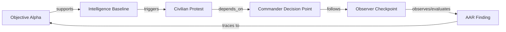
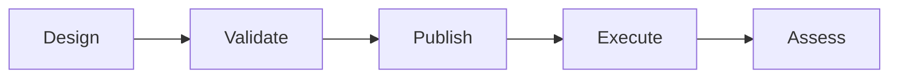

# Forge Studio Exercise Designer

Project Atlas is the Forge Studio planning environment for designing an exercise before it is published into Mission Control.

This document describes the Atlas Alpha planning workspace. Atlas is now interactive in the local Forge Studio MVP, but it still does not define durable persistence, drag and drop, real publishing, production approval routing, collaborative editing, or versioned exercise plans.

## Purpose

Exercise Designer gives planners a structured place to assemble exercise objects before execution.

It is intended to support:

- Objectives.
- Units.
- Controllers.
- Injects.
- Decision points.
- Weather events.
- Intelligence updates.
- Media events.
- Observer checkpoints.
- Templates.

The current implementation uses Project Sentinel and Mountain Exercise 3-27 as the reference implementation. Planning edits are stored in the local in-memory Exercise Data Engine for the running session and update validation, activity, audit records, and the Knowledge Graph.

## Project Atlas

Project Atlas is the planning workspace inside Forge Studio.

Atlas is separate from Mission Control:

- Atlas is where plans are drafted and validated.
- Mission Control is where approved exercise activity is executed and monitored.

Atlas Alpha includes:

- Object Library.
- Exercise Canvas / Timeline.
- Properties Inspector.
- Top toolbar.
- Editable exercise properties.
- Editable objectives.
- Editable controller assignments.
- Editable inject planning.
- Editable timeline planning.
- Live validation status.
- Exercise Relationship Engine.
- Relationship map.

## Exercise Assets

An Exercise Asset is any planning or execution object that can be connected to another object in the exercise graph.

Atlas currently models these asset types:

| Asset Type | Purpose |
| --- | --- |
| Objective | Training outcome, assessment anchor, and traceability root. |
| Inject | Planned stimulus introduced by Exercise Control. |
| Timeline Event | Scheduled or observed event on the exercise timeline. |
| Controller | Human owner responsible for planning, release, or review. |
| Product | Training product, intelligence product, media item, report, or export. |
| Intelligence Update | Information product or scenario update for the training audience. |
| Weather Event | Environmental condition that affects decisions or movement. |
| Media Event | Public affairs, social media, or simulated press activity. |
| Observer Checkpoint | Assessment marker used by observers or evaluators. |
| Observation | Recorded assessment input from observers or controllers. |
| AAR Finding | After-action review finding tied back to evidence and objectives. |

## Relationship Engine

The Exercise Relationship Engine connects exercise assets so Forge can understand how the plan is structured and why each object exists.

Supported relationship types:

| Relationship | Meaning |
| --- | --- |
| `supports` | One asset supports another asset, usually an objective. |
| `triggers` | One asset initiates another event, inject, or decision point. |
| `depends_on` | One asset requires another asset before it is valid or executable. |
| `assigned_to` | An asset is owned by a controller or role. |
| `produces` | An asset produces a product, record, or artifact. |
| `reviews` | A controller or review item reviews another asset. |
| `observes` | An observer checkpoint or observation records evidence from an asset. |
| `evaluates` | An observation or finding evaluates an objective or exercise behavior. |
| `follows` | One event follows another in the planned sequence. |
| `conflicts_with` | Two assets have a timing, ownership, or scenario conflict. |
| `related_to` | General relationship when a more specific edge is not yet defined. |

The current implementation calculates relationship data from the local Exercise Data Engine for Mountain Exercise 3-27. It does not persist graph edits beyond the running session and does not implement drag and drop.

## Exercise Graph

The exercise graph is the connected set of assets and relationships for one exercise.

In the first UI version, Atlas displays this as a simple relationship chain built from the current exercise plan:

`Exercise -> Objective -> Inject -> Controller -> Timeline Event -> AAR Finding`

## Interactive Planning

Atlas Alpha supports local CRUD-style planning workflows.

Exercise Directors and EXCON users can:

- Create exercises.
- Edit exercise name, organization context, status, phase, director, dates, training audience, and description.
- Save a draft.
- Duplicate an exercise.
- Archive an exercise.
- Add, edit, and delete objectives.
- Assign objective priority.
- Add success criteria.
- Link objectives to operational assets.
- Add and edit controller assignments.
- Assign roles and responsibilities.
- Link controllers to injects and objectives.
- Add, edit, delete, and move timeline events.
- Assign timeline time and category.
- Create and edit injects.
- Assign inject controller, time, objective, priority, and notes.

All operations remain local to the in-memory Exercise Data Engine.

## Relationship-Aware Inspector

When a planned item is selected, the Properties Inspector displays:

- Linked Objectives.
- Related Injects.
- Assigned Controller.
- Produced Products.
- Follow-on Events.
- Validation Warnings.

This allows planners to see whether a planned object has the minimum context needed to become a live exercise object.

## Relationship Validation

The first validation rules are deliberately simple:

| Rule | Purpose |
| --- | --- |
| Injects should link to at least one objective. | Keeps every inject tied to training value. |
| Injects should have an assigned controller. | Keeps release authority human-owned. |
| Timeline events should have a scheduled time. | Keeps the plan executable. |
| Products should reference a source event or inject. | Keeps the Exercise Library traceable. |
| AAR findings should trace back to an objective or observation. | Keeps assessment evidence-based. |

Atlas Alpha calculates these rules from the in-memory exercise plan. Future versions should calculate the same rules from a persisted exercise graph.

Additional Alpha checks include:

- Objectives complete.
- Controllers assigned.
- Timeline conflicts.
- Missing relationships.
- Publish readiness.

## Why Relationships Matter

Relationships give Forge traceability across the full exercise lifecycle.

They help answer operational questions such as:

- Which objective does this inject support?
- Which controller owns this event?
- Which products came from this inject?
- Which observations support this AAR finding?
- Which timeline conflicts must be resolved before publish?

Without relationships, Forge can show lists of objects. With relationships, Forge can explain the exercise.

## Mission Replay Support

Mission Replay will need to reconstruct what happened, when it happened, who controlled it, and which products or observations resulted from it.

The relationship graph gives Replay the structure to follow an exercise thread from objective to inject, product, decision, observation, and AAR finding.

## AAR Support

AARs should be evidence-based.

The Relationship Engine helps connect findings back to:

- Objectives.
- Injects.
- Timeline events.
- Observer checkpoints.
- Observations.
- Products.
- Controller decisions.

This supports a defensible after-action record instead of a loose narrative.

## Future AI-Assisted Planning Support

AI-assisted planning is not part of this sprint.

In later phases, the relationship graph can provide context for AI assistance by showing:

- Missing objective links.
- Unassigned injects.
- Weak product traceability.
- Timeline conflicts.
- Gaps between objectives and observations.
- Candidate follow-on events.

Human judgment remains authoritative. AI may suggest, but planners decide.

## Design To Execute Lifecycle

### Design

Planners assemble objectives, units, controllers, injects, decision points, and timeline events into a draft plan.

### Validate

Forge checks whether the plan has enough structure to become an executable exercise package.

The current mock validation checks are:

- Objectives linked.
- Controllers assigned.
- Timeline conflicts.
- Review requirements.
- Publish readiness.

### Publish

In the future, publishing will convert validated planning objects into live exercise objects.

Publishing must remain explicit. Forge should never silently push draft planning material into Mission Control.

### Execute

Mission Control, Timeline, Inject Library, Review Queue, Exercise Library, Controllers, Reports, and Analytics operate on live exercise objects.

## Planned Objects To Live Objects

Future mapping direction:

| Atlas Planning Object | Future Live Exercise Object |
| --- | --- |
| Objective | Exercise objective and assessment anchor |
| Unit | Entity and participating unit |
| Controller | Controller assignment |
| Inject | Inject Library item |
| Decision Point | Timeline event and review checkpoint |
| Weather Event | Timeline event, inject, or product seed |
| Intelligence Update | Intelligence product seed |
| Media Event | Media product or inject seed |
| Observer Checkpoint | Assessment marker |
| Template | Product, workflow, or exercise package template |

## Human Approval Principle

Human approval remains authoritative.

Atlas can help planners design and validate an exercise, but publishing to Mission Control should require explicit human action. Planned objects should not become live exercise objects without approval, review rules, and audit records.

The current framework includes a `Publish` toolbar control as a placeholder only. It records a human-gated publish request in audit/activity data. It does not publish, persist, or mutate live exercise state.

## Current Boundaries

The current Alpha implementation does not implement:

- Durable persistence.
- Drag and drop.
- Real publishing.
- Collaborative editing.
- Version control for plans.

## Project Sentinel Reference

Project Sentinel is the validation baseline for Atlas Alpha. Future Atlas work should preserve the ability to design, validate, inspect, and demonstrate Mountain Exercise 3-27 using Sentinel objectives, controllers, injects, timeline events, products, observations, and AAR relationships.
- Approval routing.
- Conflict resolution.
- Template import or export.

These are future capabilities.
