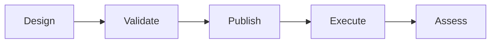

# Forge Studio Exercise Designer

Project Atlas is the Forge Studio planning environment for designing an exercise before it is published into Mission Control.

This document describes the first framework version only. It does not define persistence, drag and drop, real publishing, production approval routing, or a complete Exercise Designer implementation.

## Purpose

Exercise Designer gives planners a structured place to assemble exercise objects before execution.

It is intended to support:

- Objectives.
- Units.
- Controllers.
- Injects.
- Decision points.
- Weather events.
- Intelligence updates.
- Media events.
- Observer checkpoints.
- Templates.

The current implementation uses mock planning objects for Mountain Exercise 3-27 so the application can demonstrate the planning workflow without storing data or changing live exercise state.

## Project Atlas

Project Atlas is the planning workspace inside Forge Studio.

Atlas is separate from Mission Control:

- Atlas is where plans are drafted and validated.
- Mission Control is where approved exercise activity is executed and monitored.

The first Atlas framework includes:

- Object Library.
- Exercise Canvas / Timeline.
- Properties Inspector.
- Top toolbar.
- Mock validation status.
- Mock planning objects.

## Design To Execute Lifecycle

### Design

Planners assemble objectives, units, controllers, injects, decision points, and timeline events into a draft plan.

### Validate

Forge checks whether the plan has enough structure to become an executable exercise package.

The current mock validation checks are:

- Objectives linked.
- Controllers assigned.
- Timeline conflicts.
- Review requirements.
- Publish readiness.

### Publish

In the future, publishing will convert validated planning objects into live exercise objects.

Publishing must remain explicit. Forge should never silently push draft planning material into Mission Control.

### Execute

Mission Control, Timeline, Inject Library, Review Queue, Exercise Library, Controllers, Reports, and Analytics operate on live exercise objects.

## Planned Objects To Live Objects

Future mapping direction:

| Atlas Planning Object | Future Live Exercise Object |
| --- | --- |
| Objective | Exercise objective and assessment anchor |
| Unit | Entity and participating unit |
| Controller | Controller assignment |
| Inject | Inject Library item |
| Decision Point | Timeline event and review checkpoint |
| Weather Event | Timeline event, inject, or product seed |
| Intelligence Update | Intelligence product seed |
| Media Event | Media product or inject seed |
| Observer Checkpoint | Assessment marker |
| Template | Product, workflow, or exercise package template |

## Human Approval Principle

Human approval remains authoritative.

Atlas can help planners design and validate an exercise, but publishing to Mission Control should require explicit human action. Planned objects should not become live exercise objects without approval, review rules, and audit records.

The current framework includes a `Publish to Mission Control` toolbar control as a placeholder only. It does not publish, persist, or mutate live exercise state.

## Current Boundaries

The current framework does not implement:

- Persistence.
- Drag and drop.
- Real publishing.
- Collaborative editing.
- Version control for plans.
- Approval routing.
- Conflict resolution.
- Template import or export.

These are future capabilities.
