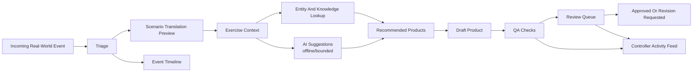
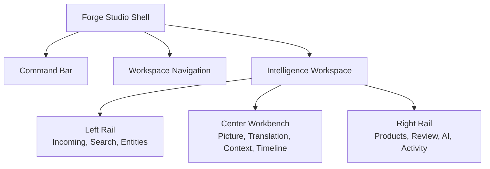
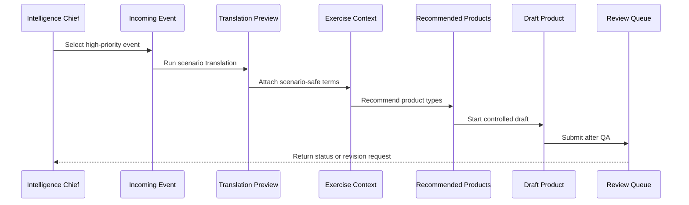

# Forge Studio Intelligence Controller Workspace

The Intelligence Controller workspace is the primary Forge Studio workbench for an Intelligence Chief supporting an active Service Level Training Exercise. It is designed for rapid situational awareness, disciplined source-to-scenario translation, product recommendation, and review-aware drafting without bypassing controller judgment.

This is a documentation-only UI/UX implementation specification. It does not implement a frontend, backend API, authentication system, external integration, live AI provider, or network data source.

## Purpose

The Intelligence Controller workspace gives intelligence controllers one dense operating surface for turning incoming real-world events into scenario-consistent intelligence activity and controlled draft products.

It should help the Intelligence Chief answer:

- What is the current intelligence picture inside the exercise?
- Which incoming real-world events require attention?
- How would this source material translate into the scenario?
- Which entities, events, objectives, and knowledge references matter?
- Which product types are recommended?
- Which drafts are blocked, in review, approved, or stale?
- What has AI-assisted reasoning suggested, and what remains controller-owned?
- What did the intelligence cell do recently, and where is the audit trail?

The workspace should minimize clicks by keeping source, context, translation, entities, objectives, products, review status, and activity visible at the same time.

## Primary Users

| User | Need |
| --- | --- |
| Intelligence Chief | Maintain the intelligence picture, prioritize events, assign work, approve recommendations for review, and monitor product flow. |
| Intelligence Controller | Convert incoming events into scenario-safe intelligence products and update event/product context. |
| EXCON Controller | Coordinate event implications and request intelligence products. |
| Reviewer | Inspect intelligence drafts, QA findings, source references, and scenario traceability. |
| Exercise Director | View high-risk intelligence items, escalation-sensitive events, and pending approvals. |
| Viewer | Observe the intelligence picture and recent products without editing controlled artifacts. |

## Design Goals

- Keep the current intelligence picture visible at all times.
- Put incoming events, translation preview, and context side by side.
- Support keyboard-first triage and product creation.
- Expose recommended products without allowing automatic release.
- Preserve clear boundaries between real-world source text and notional exercise truth.
- Make AI suggestions visibly advisory, bounded, and audit-backed.
- Use dense tables, compact cards, and split panes rather than consumer-style dashboards.

## Service Alignment

| Workspace Area | Primary Forge Services |
| --- | --- |
| Current Intelligence Picture | Context Engine, Exercise State Engine, Scenario Engine, Event Engine |
| Incoming Real World Events | Integration Service, Event Engine, Storage Service |
| Scenario Translation Preview | Translation Engine, Profile Manager, Entity Engine |
| Exercise Context | Context Engine, Scenario Engine, Exercise State Engine, Decision Engine |
| Knowledge Base Search | Knowledge Engine, Search Service |
| Entity Browser | Entity Engine, Search Service, Translation Engine |
| Event Timeline | Event Engine, Exercise State Engine, Audit Service |
| Recommended Products | Product SDK, Decision Engine, Profile Manager |
| Draft Products | Product SDK, QA Service, Review Queue |
| Review Status | Review Queue, QA Service, Audit Service |
| AI Suggestions | AI Reasoning Engine, Pipeline Orchestrator, Audit Service |
| Exercise Objectives | Scenario Engine, Context Engine |
| Recent Intelligence Products | Product SDK, Review Queue, Distribution Service |
| Quick Actions | Workflow Engine, Pipeline Orchestrator, Security Service |
| Controller Activity Feed | Audit Service, Metrics Service |
| Metrics | Metrics Service |

## Workflow



Workflow rules:

- No product may skip QA or review.
- Scenario translation must appear before product drafting.
- AI suggestions may influence recommendations but cannot create released products.
- Source references and context references must remain visible through the draft and review flow.
- High-severity or escalation-sensitive events should be marked for Intelligence Chief review.

## Navigation

Suggested future route:

```text
/workspaces/:workspaceId/intelligence
```

Navigation entry:

- Label: Intelligence
- Group: Production or Exercise Picture
- Icon intent: scope, radar, file-search, or brain-circuit
- Badge: count of high-priority incoming events plus assigned intelligence reviews

Command bar additions:

- Intelligence workspace selector
- Event severity filter
- Entity quick search
- Product quick create
- Open Knowledge Search
- Open Review Queue
- Refresh workspace

## Layout

The workspace should use a three-zone command workbench on desktop:

- Left rail: incoming events, filters, knowledge search, entity browser.
- Center: current intelligence picture, translation preview, context, timeline.
- Right rail: recommended products, drafts, review status, AI suggestions, activity, metrics.

### Desktop Wireframe

```text
+----------------------------------------------------------------------------------------------------------+
| Forge Studio | Workspace | Day / Phase / Profile | Intelligence Search             Alerts | User       |
+-----------------------+---------------------------------------------------------------+------------------+
| Intelligence Nav      | Current Intelligence Picture                                 | Quick Actions    |
| - Picture             | Summary, active concerns, priority entities, source posture | Create draft     |
| - Incoming            +---------------------------------------------------------------+ Run translation  |
| - Knowledge           | Scenario Translation Preview          | Exercise Context | Assign review    |
| - Entities            | Source text -> scenario terms         | State, facts     +------------------+
| - Timeline            | Applied rules, warnings, confidence   | Objectives       | Recommended      |
| - Drafts              +--------------------------------------+----------------+ Products         |
|                       | Incoming Real World Events             | Event Timeline   | INTSUM/IIR/etc   |
| Filters               | Priority table, source, severity       | Now/next lanes   +------------------+
| Severity              +--------------------------------------+----------------+ Draft Products   |
| Source type           | Knowledge Base Search                  | Entity Browser   | QA/review status |
| Product type          | Query, filters, results, references    | Related actors   +------------------+
| Assignment            +--------------------------------------+----------------+ AI Suggestions   |
|                       | Exercise Objectives                    | Recent Intel     | Bounded advisory |
|                       | Training objective relevance           | Products         +------------------+
|                       +---------------------------------------------------------------+ Activity/Metrics |
+-----------------------+---------------------------------------------------------------+------------------+
```

### Panel Priority

| Priority | Panels |
| --- | --- |
| Always visible | Current Intelligence Picture, Incoming Real World Events, Scenario Translation Preview, Exercise Context, Quick Actions |
| Primary | Knowledge Base Search, Entity Browser, Event Timeline, Recommended Products, Draft Products, Review Status |
| Secondary | AI Suggestions, Exercise Objectives, Recent Intelligence Products, Controller Activity Feed, Metrics |
| Collapsible | Metrics, Recent Intelligence Products, Activity Feed, AI Suggestions |

### Mobile Layout

Mobile should become a task stack for urgent awareness:

1. Current Intelligence Picture
2. Incoming Real World Events
3. Quick Actions
4. Scenario Translation Preview
5. Exercise Context
6. Recommended Products
7. Draft Products and Review Status
8. Event Timeline
9. Knowledge Base Search
10. Entity Browser
11. AI Suggestions
12. Activity Feed
13. Metrics

## Panels

### Current Intelligence Picture

Purpose: Summarize the active intelligence state for the exercise.

Data sources:

- Context Engine
- Exercise State Engine
- Scenario Engine
- Event Engine
- Decision Engine

Required content:

- Exercise day, phase, tempo, escalation
- Current intelligence summary
- Priority entities
- Active events affecting intelligence picture
- Source posture: new, validated, translated, productized
- Scenario consistency warnings

Interactions:

- Click priority entity to open Entity Browser detail.
- Click active event to open Event Timeline and event detail.
- Click warning to open Decision Engine finding.
- Pin summary to current product draft context.

Empty state:

- "No intelligence picture has been assembled for this workspace."

### Incoming Real World Events

Purpose: Triage staged real-world events or dry-run integration signals.

Data sources:

- Integration Service
- Event Engine
- Storage Service
- Audit Service

Required columns:

- Priority
- Source type
- Event title
- Received time
- Severity
- Translation status
- Related entities
- Owner
- Action

Interactions:

- Single-click selects event.
- Enter opens detail.
- `T` runs translation preview for selected event.
- `D` opens draft-product choices for selected event.
- Context menu supports assign, mark duplicate, create exercise event, add note, open audit.

Empty state:

- "No incoming events are staged for intelligence review."

### Scenario Translation Preview

Purpose: Show how real-world terms become scenario-consistent exercise language.

Data sources:

- Translation Engine
- Profile Manager
- Entity Engine
- Scenario Engine

Required content:

- Source excerpt
- Scenario-language preview
- Applied translation rules
- Unmatched terms
- Real-world leakage warnings
- Confidence or review requirement

Interactions:

- Toggle side-by-side or inline diff.
- Click applied rule to view dictionary metadata.
- Flag unmatched term for profile/dictionary review.
- Copy translated excerpt into draft context.

Empty state:

- "Select an incoming event to preview scenario translation."

### Exercise Context

Purpose: Provide the scenario facts needed before drafting.

Data sources:

- Context Engine
- Scenario Engine
- Exercise State Engine
- Decision Engine
- Knowledge Engine

Required content:

- Scenario facts
- Assumptions
- Constraints
- Control measures
- Current exercise state
- Decision Engine findings
- Linked knowledge references

Interactions:

- Pin context item to draft.
- Open source reference.
- Request scenario clarification.
- Filter context by objective, entity, or event.

Empty state:

- "No exercise context is available for the selected item."

### Knowledge Base Search

Purpose: Find durable exercise knowledge and references without leaving the workspace.

Data sources:

- Knowledge Engine
- Search Service

Required content:

- Query input
- Scope filters
- Result list
- Document type
- Reference path
- Tags and metadata
- Preview

Interactions:

- `/` focuses workspace search.
- `K` focuses knowledge search.
- Enter opens selected result.
- Pin result to context or draft.

Empty state:

- "No knowledge results matched the current filters."

### Entity Browser

Purpose: Browse exercise actors, units, locations, platforms, capabilities, and relationships.

Data sources:

- Entity Engine
- Search Service
- Translation Engine

Required content:

- Entity name
- Category
- Affiliation
- Aliases
- Related events
- Related products
- Relationship summary
- Translation mapping state

Interactions:

- Search by name, alias, category, affiliation.
- Click related event to filter timeline.
- Pin entity to draft context.
- Open relationship graph in detail view.

Empty state:

- "No entities match the current filters."

### Event Timeline

Purpose: Show intelligence-relevant events across the active exercise day and phase.

Data sources:

- Event Engine
- Exercise State Engine
- Audit Service
- Review Queue

Required content:

- Timeline lane for incoming events
- Timeline lane for exercise events
- Timeline lane for draft products
- Timeline lane for review actions
- Current time marker
- Severity and status labels

Interactions:

- Filter by severity, entity, product, status, or owner.
- Click event to open detail.
- Dragging is not required in the first implementation; timeline edits should open detail workflow.

Empty state:

- "No intelligence events are visible for this exercise day."

### Recommended Products

Purpose: Suggest product types for selected events and context.

Data sources:

- Product SDK
- Decision Engine
- Profile Manager
- Context Engine

Recommended product families:

- Intelligence Summary
- Intelligence Information Report
- Spot Report
- News Article
- Social Media

Required content:

- Product type
- Recommendation reason
- Required context readiness
- Source reference readiness
- Profile/plugin version
- Estimated review path

Interactions:

- Click recommendation to open draft setup.
- Compare product types.
- Dismiss recommendation with reason.
- Pin recommendation to controller activity.

Empty state:

- "No product recommendations are available for the selected context."

### Draft Products

Purpose: Track intelligence product drafts in progress.

Data sources:

- Product SDK
- QA Service
- Review Queue
- Audit Service

Required content:

- Product title
- Product type
- Product ID
- Owner
- QA status
- Review status
- Source reference count
- Last updated

Interactions:

- Open draft.
- Run QA.
- Submit for review.
- Assign owner.
- Add note.

Empty state:

- "No intelligence drafts are in progress."

### Review Status

Purpose: Show intelligence products awaiting review, revision, approval, or rejection.

Data sources:

- Review Queue
- QA Service
- Audit Service

Required content:

- Review item
- Assigned reviewer
- Priority
- QA status
- Age
- Decision state
- Blocking findings

Interactions:

- Open review item.
- Filter assigned to me.
- Open QA findings.
- Request revision from detail workflow.

Empty state:

- "No intelligence products are awaiting review."

### AI Suggestions

Purpose: Show bounded, advisory AI reasoning support for selected context.

Data sources:

- AI Reasoning Engine
- Pipeline Orchestrator
- Audit Service

Required content:

- Provider mode: offline stub, disabled, or future approved provider
- Suggestion summary
- Input context metadata
- Confidence or caveat notes
- Last request time
- Audit reference

Rules:

- Do not show raw prompt or response content by default.
- Label suggestions as advisory.
- Keep apply actions explicit and reversible until submitted for review.
- Do not allow AI suggestions to bypass translation, QA, or review.

Empty state:

- "No AI suggestions are available for the selected context."

### Exercise Objectives

Purpose: Keep training objectives visible while intelligence products are drafted.

Data sources:

- Scenario Engine
- Context Engine
- Decision Engine

Required content:

- Objective title
- Priority
- Relevance to selected event/context
- Linked events
- Linked products
- Coverage status

Interactions:

- Pin objective to draft.
- Filter events and products by objective.
- Open objective detail.

Empty state:

- "No exercise objectives are linked to the selected context."

### Recent Intelligence Products

Purpose: Provide fast access to recently drafted, reviewed, approved, or distributed intelligence products.

Data sources:

- Product SDK
- Review Queue
- Distribution Service
- Metrics Service

Required content:

- Product title
- Product type
- Status
- Owner
- Review decision
- Last update
- Distribution dry-run state

Interactions:

- Open product.
- Filter by type/status/owner.
- Duplicate context into a new draft only through controlled workflow.

Empty state:

- "No recent intelligence products are available."

### Quick Actions

Purpose: Minimize clicks for frequent intelligence-cell tasks.

Actions:

- Create intelligence event
- Run scenario translation
- Search knowledge base
- Open entity browser
- Recommend products
- Draft Intelligence Summary
- Draft IIR
- Draft Spot Report
- Run QA
- Submit to review
- Add controller note

Rules:

- Actions must respect role permissions.
- High-impact actions open detail workflows.
- Disabled actions explain missing context or permission.

### Controller Activity Feed

Purpose: Show intelligence-cell actions as readable audit-backed updates.

Data sources:

- Audit Service
- Pipeline Orchestrator
- Workflow Engine
- Review Queue
- QA Service
- Metrics Service

Required content:

- Actor
- Action
- Target
- Service
- Time
- Severity
- Correlation ID

Interactions:

- Filter by actor, service, event, product, severity, or time.
- Click correlation ID to open audit trail.
- Click target to open detail.

Empty state:

- "No intelligence controller activity has been recorded."

### Metrics

Purpose: Show intelligence-cell operational health.

Data sources:

- Metrics Service
- Product SDK
- QA Service
- Review Queue
- Search Service

Required metrics:

- Incoming events triaged today
- Products drafted today
- Products in review
- QA warnings and failures
- Average review age
- Knowledge searches
- Entity lookups
- AI requests

Visual rules:

- Compact metric cards.
- Use units and snapshot time.
- Avoid decorative charts.

## Filtering

Global workspace filters:

- Exercise day
- Phase
- Severity
- Source type
- Entity
- Product type
- Objective
- Owner
- Review status
- QA status
- Time range

Filter behavior:

- Filters apply to visible panels where relevant.
- Panel-specific filters may override global filters only inside that panel.
- Active filters remain visible as chips.
- Clearing filters restores the workspace default view.
- Saved filter sets may be role-specific in future implementation.

## Searching

Search surfaces:

- Global workspace search
- Knowledge Base Search
- Entity Browser search
- Incoming event search
- Product search
- Activity/audit search

Search rules:

- Search must be deterministic and local in the current foundation.
- Search results should show source service and freshness.
- Search should preserve context filters.
- Search should support keyboard navigation.
- Semantic, vector, or hybrid search remain future capabilities only.

## Keyboard Shortcuts

Keyboard shortcuts should optimize triage and drafting.

| Shortcut | Action |
| --- | --- |
| `/` | Focus workspace search |
| `K` | Focus Knowledge Base Search |
| `E` | Focus Entity Browser |
| `I` | Focus Incoming Real World Events |
| `T` | Run translation preview for selected event |
| `R` | Open Recommended Products |
| `D` | Start draft workflow for selected context |
| `Q` | Open QA findings for selected draft |
| `V` | Open Review Status |
| `A` | Open AI Suggestions |
| `M` | Open Metrics |
| `F` | Open filters |
| `Esc` | Close drawer, menu, or clear transient focus |
| `Enter` | Open selected item |
| `Shift+Enter` | Open selected item in detail drawer |

Shortcuts must be discoverable in a keyboard shortcuts dialog and must not override text entry.

## Context Menus

Context menus should be available on incoming events, entities, timeline items, recommended products, drafts, and review items.

Common menu actions:

- Open detail
- Pin to context
- Add note
- Copy identifier
- Open audit trail
- Filter by this item

Incoming event menu:

- Run translation preview
- Create exercise event
- Mark duplicate
- Recommend products
- Assign owner

Entity menu:

- Pin entity to draft
- Show related events
- Show related products
- Open relationship graph

Draft product menu:

- Run QA
- Submit for review
- Assign owner
- Open source references
- Open review history

Menu rules:

- Dangerous or audit-significant actions require detail workflow or confirmation.
- Permission-denied actions should be disabled with explanation.
- Context menus must be keyboard accessible.

## Notifications

Notification categories:

- High-priority incoming event
- Translation warning or unmatched term
- Scenario inconsistency
- Recommended product ready
- Draft QA failed
- Review assigned
- Revision requested
- Approval required
- AI suggestion ready
- Pipeline or service failure

Notification rules:

- Critical notifications remain pinned until acknowledged or resolved.
- Routine notifications may appear in activity feed only.
- Notification actions open the relevant detail screen.
- Notifications should identify source service and target object.

## Collaboration

Collaboration should support controller coordination without replacing audit records.

Capabilities:

- Assign event, draft, or review item.
- Add controller note.
- Request scenario clarification.
- Request entity confirmation.
- Mention controller or role in notes.
- Escalate to Intelligence Chief or Exercise Director.
- Preserve handoff reason and timestamp.

Rules:

- Comments attach to a concrete event, entity, product, review, or context item.
- Reassignment requires reason.
- Escalation requires note.
- Collaboration actions appear in activity feed and audit.

## Accessibility

The workspace must meet Forge Studio accessibility requirements.

Requirements:

- Keyboard navigation across all panes and tables.
- Visible focus states.
- Tables expose headers, sort state, selected rows, and row actions.
- Translation preview has text alternative to color-only diff.
- Timeline has list/table fallback.
- Entity relationship graph has a list equivalent.
- Status and severity use icon, label, and color.
- Context menus are keyboard accessible.
- Notifications use accessible live regions.
- Draft and review action confirmations are screen-reader clear.
- Panel resize and collapse controls are keyboard accessible.

## Performance Expectations

The workspace must feel fast during active exercise tempo.

Expectations:

- Initial workspace shell render target: under 2 seconds in future implementation.
- Panel refresh should preserve selection, scroll, filters, and expanded state.
- Search results should return quickly for local indexes.
- Large tables should support virtualization in future frontend implementation.
- Timeline should render only visible window plus buffer.
- Entity graph should lazy-load relationship detail.
- AI suggestions should show pending state with source and stage metadata.
- Failed panel refresh should preserve last known data with visible stale indicator.

Suggested refresh cadence:

| Panel | Cadence |
| --- | --- |
| Incoming Real World Events | 30 seconds or manual |
| Current Intelligence Picture | 30 seconds |
| Translation Preview | On selected event change or manual |
| Exercise Context | On selected event/context change |
| Knowledge Search | On query |
| Entity Browser | On query/filter |
| Event Timeline | 30 seconds |
| Recommended Products | On selected context change |
| Draft Products | 30 seconds |
| Review Status | 30 seconds |
| AI Suggestions | On request completion |
| Activity Feed | 30 seconds |
| Metrics | 60 seconds |

## Wireframes

### Primary Workspace Anatomy



### Event-To-Product Flow



### Dense Desktop Wireframe

```text
+------------------------------------------------------------------------------------------------------------+
| Workspace / Day / Phase / Profile       Search Intelligence...               Alerts  Refresh  User          |
+----------------------+--------------------------------------------------------------+----------------------+
| Intelligence Nav     | Current Intelligence Picture                              | Quick Actions        |
| Picture              | Active concerns, priority entities, source posture        | Event / Translate    |
| Incoming             +------------------------------+-------------------------------+ Draft / QA / Review  |
| Knowledge            | Scenario Translation      | Exercise Context              +----------------------+
| Entities             | Real-world -> scenario    | Facts, constraints, state     | Recommended Products |
| Timeline             | Rules, warnings, preview  | Objectives, references        | INT SUM / IIR / SR   |
| Drafts               +------------------------------+-------------------------------+----------------------+
| Reviews              | Incoming Real World Events | Event Timeline                | Draft Products       |
|                      | Priority table             | Now, next, linked products    | QA and review state  |
| Filters              +------------------------------+-------------------------------+----------------------+
| Severity             | Knowledge Base Search      | Entity Browser                | AI Suggestions       |
| Entity               | Results and preview        | Actors, aliases, links        | Advisory only        |
| Product              +------------------------------+-------------------------------+----------------------+
| Owner                | Exercise Objectives        | Recent Intelligence Products  | Activity / Metrics   |
+----------------------+--------------------------------------------------------------+----------------------+
```

## Implementation Checklist

A future implementation is ready when:

- All required workspace panels are represented.
- Incoming event selection updates translation, context, entities, recommendations, and timeline.
- Source and scenario text remain visually separated.
- Recommended products cannot bypass QA or review.
- AI suggestions are labeled advisory and audit-linked.
- Keyboard shortcuts cover triage, search, translation, draft, review, and filters.
- Context menus are permission-aware and keyboard accessible.
- Filters and search preserve controller context.
- Collaboration actions produce activity and audit records.
- Performance rules preserve selections and stale data visibility.
- Mobile layout supports urgent awareness and review handoff.
