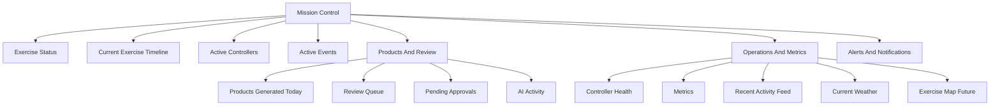
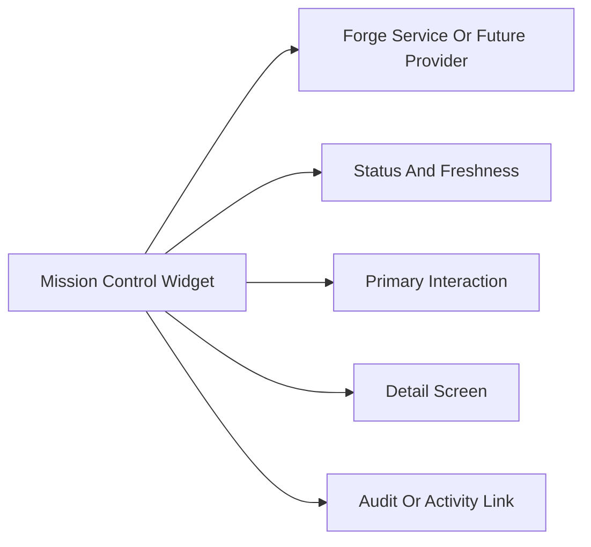

# Forge Studio Mission Control Dashboard

Mission Control is the primary operational dashboard for Forge Studio. It provides the first real-time exercise picture a controller sees after opening a workspace. The dashboard should resemble an operations center: dense, calm, status-rich, and action-oriented.

This is a documentation-only implementation specification. It does not implement a frontend, live data service, map provider, weather provider, authentication provider, or network integration.

## Purpose

Mission Control gives Exercise Control teams a shared operating picture of the active exercise workspace.

It should answer:

- What is the current exercise state?
- What is happening now?
- What needs controller action?
- Which products are moving through QA and review?
- Which controllers are active, overloaded, or unavailable?
- What alerts, events, and workflow failures threaten exercise control?
- What did Forge do recently, and where is the audit trail?

Mission Control is not a business analytics dashboard. It is an operational command surface for maintaining scenario fidelity, controller authority, product flow, and exercise tempo.

## Intended Users

| User | Mission Control Need |
| --- | --- |
| Exercise Director | See exercise tempo, escalation, high-risk approvals, alert posture, and release pressure. |
| EXCON Controller | Track assigned work, active events, timeline pressure, review queue, and recent activity. |
| Intelligence Controller | Monitor intelligence products, source-backed events, AI stub activity, QA findings, and pending reviews. |
| Media Controller | Track media products, narrative timing, pending approvals, and public information style alerts. |
| Reviewer | See review queue pressure, assigned approvals, blocking QA findings, and revision requests. |
| Scenario Manager | Monitor scenario state, active events, timeline integrity, entity/event changes, and controller notes. |
| Platform Administrator | Monitor service health, security denials, pipeline status, metrics, and configuration-impacting alerts. |
| Viewer | Observe workspace status, timeline, products, alerts, and activity without editing controlled artifacts. |

## Design Principles

- Lead with exercise state, not charts.
- Use compact operational cards, tables, and timeline lanes.
- Keep high-risk work visible without overwhelming routine work.
- Show stale data clearly.
- Pair every color with labels and icons.
- Make every widget clickable into its owning workflow or service detail.
- Preserve source, scenario, review, audit, and metrics traceability.
- Avoid consumer styling, gamified progress, decorative maps, or marketing hero surfaces.

## Information Architecture



## Layout

Mission Control should use the Forge Studio app shell:

- Fixed command bar at top
- Persistent workspace sidebar on desktop
- Dense dashboard canvas
- Optional right operational rail for alerts and activity
- Dark theme primary, light theme secondary

### Desktop Wireframe

```text
+--------------------------------------------------------------------------------------------------+
| Forge Studio | Workspace | Day / Phase / Profile | Global Search                 Alerts | User |
+----------------------+---------------------------------------------------------------------------+
| Sidebar              | Exercise Status Strip                                                     |
| Dashboard            | Day 03 | Phase II | Tempo: High | Escalation: Elevated | Last refresh    |
| Intake               +--------------------------+--------------------------+-------------------------+
| Exercise Picture     | Current Exercise Timeline                            | Alerts                 |
| Production           | Phase lane / event lane / product lane / review lane | Critical and high      |
| Quality And Review   |                                                     |                         |
| Operations           +--------------------------+--------------------------+-------------------------+
| Administration       | Active Events            | Review Queue             | Active Controllers      |
|                      | Severity, status, owner  | Priority, QA, age        | Cell, load, availability|
|                      +--------------------------+--------------------------+-------------------------+
|                      | Products Today           | Pending Approvals        | Controller Health       |
|                      | Type, status, QA         | Director/reviewer queue  | Load, coverage, risk    |
|                      +--------------------------+--------------------------+-------------------------+
|                      | Current Weather          | AI Activity              | Metrics                 |
|                      | Local/manual/future      | Stub/provider status     | Workflow/product/QA     |
|                      +--------------------------+--------------------------+-------------------------+
|                      | Exercise Map Future      | Recent Activity Feed                               |
|                      | Controlled placeholder   | Audit-backed activity stream                       |
+----------------------+---------------------------------------------------------------------------+
```

### Grid Allocation

| Region | Desktop Grid | Priority |
| --- | --- | --- |
| Exercise Status Strip | 12 columns | Always visible |
| Current Exercise Timeline | 8 columns | Primary |
| Alerts | 4 columns | Primary |
| Active Events | 4 columns | Primary |
| Review Queue | 4 columns | Primary |
| Active Controllers | 4 columns | Primary |
| Products Generated Today | 4 columns | Secondary |
| Pending Approvals | 4 columns | Secondary |
| Controller Health | 4 columns | Secondary |
| Current Weather | 3 columns | Supporting |
| AI Activity | 3 columns | Supporting |
| Metrics | 6 columns | Supporting |
| Exercise Map Future | 4 columns | Future |
| Recent Activity Feed | 8 columns | Supporting |

### Tablet Layout

Tablet layout should collapse to two columns:

- Status strip remains full width.
- Timeline remains first.
- Alerts and Review Queue follow.
- Cards stack in operational priority order.
- Sidebar collapses to icon rail.

### Mobile Layout

Mobile layout should become a single-column operational feed:

1. Exercise Status
2. Alerts
3. Pending Approvals
4. Review Queue
5. Current Timeline
6. Active Events
7. Active Controllers
8. Products Generated Today
9. Controller Health
10. Current Weather
11. AI Activity
12. Metrics
13. Recent Activity Feed
14. Exercise Map Future

## Navigation

Mission Control is the default route for an active workspace.

Suggested future route:

```text
/workspaces/:workspaceId/mission-control
```

Navigation entry:

- Label: Mission Control
- Group: Dashboard
- Icon intent: command, activity, or layout dashboard
- Badge: critical alert count when greater than zero

Command bar actions:

- Open global search
- Create signal
- Create event
- Open review queue
- Open timeline
- Acknowledge alerts
- Refresh dashboard
- Open dashboard customization

## Widget Overview

Every widget should define:

- Purpose
- Data source
- Refresh behavior
- Empty state
- Click-through destination
- Permission behavior
- Accessibility notes



## Widgets

### Exercise Status

Purpose: Show the active exercise operating state at a glance.

Primary data sources:

- Exercise State Engine
- Scenario Engine
- Profile Manager
- Metrics Service
- Configuration Service

Required fields:

- Exercise name
- Exercise day
- Phase
- Tempo
- Escalation level
- Active scenario
- Active profile
- Current control measures count
- Last refresh timestamp

Visual design:

- Full-width status strip directly under the command bar.
- Use compact cells separated by borders.
- Tempo and escalation use status indicators with text.
- Stale state shows warning label: "State stale".

Interactions:

- Click exercise day or phase to open Timeline.
- Click profile to open Profile detail.
- Click control measures count to open Scenario controls.
- Refresh icon updates all Mission Control widgets.

Empty state:

- "No exercise state is loaded for this workspace."

### Current Exercise Timeline

Purpose: Show what is happening now, what is next, and which products or reviews are tied to exercise time.

Primary data sources:

- Exercise State Engine
- Event Engine
- Review Queue
- Product SDK
- Audit Service

Required fields:

- Exercise day lane
- Phase lane
- Active events lane
- Product lane
- Review lane
- Distribution lane
- Current time marker

Visual design:

- Largest dashboard widget.
- Horizontal lanes on desktop.
- Current time marker uses command accent.
- Critical events use labeled severity markers.
- Planned vs actual states are visually distinct.

Interactions:

- Click event to open Event detail.
- Click product to open Product detail.
- Click review marker to open Review item.
- Filter by day, cell, event severity, product type, or status.
- Toggle audit markers.

Empty state:

- "No timeline items are scheduled for this exercise day."

### Active Controllers

Purpose: Show who is currently operating in the workspace and where controller load sits.

Primary data sources:

- Security Service
- Review Queue
- Audit Service
- Metrics Service
- Future presence service

Required fields:

- Controller name
- Role
- Cell or desk
- Availability
- Assigned review items
- Assigned products or events
- Last activity

Visual design:

- Compact controller cards or dense list.
- Role chip visible.
- Availability combines icon, label, and timestamp.
- Overloaded controllers flagged with warning status.

Interactions:

- Click controller to open controller detail or filtered activity.
- Click assignment count to open filtered queue.
- Exercise directors can reassign work when permitted.

Empty state:

- "No active controllers are visible for this workspace."

### Review Queue

Purpose: Show review pressure and the highest-priority products awaiting human action.

Primary data sources:

- Review Queue
- QA Service
- Product SDK
- Audit Service

Required fields:

- Total pending reviews
- Critical QA count
- Overdue count
- Top review items
- Assigned reviewer
- Priority
- Age

Visual design:

- Dense table or stacked review cards.
- Critical and overdue items pinned to top.
- Status label always visible.

Interactions:

- Click item to open Review detail.
- Click "View all" to open Review Queue.
- Reviewers can open assigned work directly.
- Exercise directors can filter to escalated items.

Empty state:

- "No products are awaiting review."

### Products Generated Today

Purpose: Summarize product throughput for the current exercise day.

Primary data sources:

- Product SDK
- QA Service
- Review Queue
- Metrics Service

Required fields:

- Total products generated today
- Draft count
- QA warning/fail count
- In review count
- Approved count
- Product type breakdown

Visual design:

- Metric card plus compact product-type breakdown.
- Avoid celebratory charting.
- Show "today" as exercise day, not necessarily wall-clock date.

Interactions:

- Click total to open Products filtered to current exercise day.
- Click QA count to open QA Findings.
- Click product type to filter Products.

Empty state:

- "No products have been generated for this exercise day."

### Pending Approvals

Purpose: Highlight work requiring explicit human approval.

Primary data sources:

- Review Queue
- Security Service
- QA Service
- Audit Service

Required fields:

- Approval item
- Required role
- Assigned approver
- Reason approval is required
- Age
- Blocking status

Visual design:

- High-priority compact list.
- Distinguish reviewer approval from exercise director approval.
- Use caution status for pending and critical status for overdue/blocking.

Interactions:

- Click approval to open Review detail.
- Authorized users see approve, reject, and request revision actions after opening detail.
- Unauthorized users see view-only state with role requirement.

Empty state:

- "No approvals are pending."

### Current Weather

Purpose: Show weather conditions relevant to the scenario or venue.

Primary data sources:

- Current foundation: manual workspace configuration or exercise profile metadata
- Future: approved weather provider or local weather feed
- No live network weather calls are assumed by this specification

Required fields:

- Location or training area
- Conditions
- Temperature
- Wind
- Visibility
- Effective time
- Source label: manual, profile, or future provider

Visual design:

- Compact environmental card.
- Show freshness and source clearly.
- Use neutral styling unless a weather impact is operationally significant.

Interactions:

- Click to open environmental context or profile weather notes.
- If manually supplied, authorized controllers may open edit workflow from detail screen.

Empty state:

- "No weather context is configured for this workspace."

### Exercise Map Future

Purpose: Reserve dashboard space for future geospatial exercise context.

Primary data sources:

- Future map layer service
- Entity Engine
- Event Engine
- Scenario Engine
- Exercise State Engine

Required fields for future implementation:

- Map area name
- Visible layers
- Active event markers
- Entity markers
- Timeline-linked markers
- Source and freshness

Visual design:

- Do not use decorative map imagery.
- Current state should be a controlled placeholder.
- Future map must support dark theme and tactical readability.

Interactions:

- Future click marker to open Event or Entity detail.
- Future layer toggles for events, entities, control measures, and products.

Empty state:

- "Exercise map is reserved for a future approved map provider."

### Active Events

Purpose: Show events currently affecting the exercise picture.

Primary data sources:

- Event Engine
- Scenario Engine
- Entity Engine
- Decision Engine
- Context Engine

Required fields:

- Event title
- Severity
- Event type
- Exercise day and phase
- Related entities
- Status
- Decision result indicator

Visual design:

- Dense event cards or table.
- Severity marker on left edge.
- Exercise day and phase in monospace metadata.
- Highlight escalation-sensitive events.

Interactions:

- Click event to open Event detail.
- Filter by severity, type, phase, entity, and owner.
- Create product from event from detail screen, not inline dashboard.

Empty state:

- "No active events are currently affecting this exercise day."

### AI Activity

Purpose: Show bounded AI or offline reasoning activity without implying uncontrolled generation.

Primary data sources:

- AI Reasoning Engine
- Pipeline Orchestrator
- Product SDK
- Audit Service
- Metrics Service

Required fields:

- Provider mode: offline stub, future provider, disabled
- Requests today
- Failed requests
- Last request metadata
- Products using AI-assisted reasoning
- Policy or provider status

Visual design:

- Use restrained system activity styling.
- Label offline stub clearly.
- Do not display prompt or response content by default.
- Show policy warnings if provider is disabled or unavailable.

Interactions:

- Click to open AI activity audit or pipeline stage results.
- Admins can open provider configuration from detail screen when permitted.

Empty state:

- "No AI reasoning activity has been recorded for this exercise day."

### Controller Health

Purpose: Show controller coverage, workload, and operational risk.

Primary data sources:

- Security Service
- Review Queue
- Metrics Service
- Audit Service
- Future presence service

Required fields:

- Active controller count
- Unassigned review items
- Overloaded controller count
- Inactive critical role count
- Average review age
- Cell coverage status

Visual design:

- Metric card with coverage status.
- Use warning only when there is a workload or coverage problem.
- Avoid wellness or consumer productivity language.

Interactions:

- Click to open controller roster or workload detail.
- Exercise directors can open reassignment workflow from detail.

Empty state:

- "Controller health data is not available for this workspace."

### Alerts

Purpose: Show urgent operational conditions requiring attention.

Primary data sources:

- QA Service
- Review Queue
- Pipeline Orchestrator
- Audit Service
- Security Service
- Metrics Service
- Configuration Service

Alert categories:

- Critical QA finding
- Approval overdue
- Pipeline stage failed
- Security denial
- Configuration/profile change
- Distribution dry-run failed
- Controller coverage gap
- Stale exercise state

Visual design:

- Right rail or top-right widget.
- Critical alerts stay pinned until acknowledged.
- Alert items include icon, severity, title, target, time, and action.

Interactions:

- Acknowledge alert.
- Open target detail.
- Filter by severity.
- View alert in audit log.

Empty state:

- "No active alerts."

### Metrics

Purpose: Show operational health and throughput snapshots.

Primary data sources:

- Metrics Service
- Pipeline Orchestrator
- Review Queue
- QA Service
- Product SDK

Required metrics:

- Products generated today
- QA pass/warn/fail counts
- Review queue size
- Average review age
- Pipeline success/failure count
- AI request count
- Distribution dry-run count

Visual design:

- Compact metric cards, not decorative charts.
- Include units and snapshot time.
- Use text labels for trends.

Interactions:

- Click metric to open Metrics detail.
- Filter metrics by service or exercise day.

Empty state:

- "No metrics snapshot has been captured yet."

### Recent Activity Feed

Purpose: Show a readable audit-backed stream of recent workspace activity.

Primary data sources:

- Audit Service
- Pipeline Orchestrator
- Workflow Engine
- QA Service
- Review Queue
- Distribution Service
- Security Service

Required fields:

- Actor
- Action
- Target
- Service
- Time
- Severity
- Correlation ID

Visual design:

- Feed cards or dense list.
- Actor and action form the first sentence.
- Correlation ID and service use metadata styling.
- Raw audit entry link available.

Interactions:

- Click item to open target detail.
- Click correlation ID to open filtered audit trail.
- Filter by service, actor, severity, or time.

Empty state:

- "No recent activity has been recorded."

## Dashboard Refresh Behavior

Mission Control should support live-feeling updates without assuming a production realtime backend.

Refresh modes:

| Mode | Behavior |
| --- | --- |
| Manual | User clicks refresh. All widgets request latest workspace snapshot. |
| Timed | Future implementation may refresh low-risk widgets on a configured interval. |
| Event driven | Future implementation may update widgets when local service events are emitted. |
| Paused | User pauses auto-refresh while reviewing content. |

Refresh rules:

- Show last refresh time in the Exercise Status strip.
- Show per-widget freshness when sources update independently.
- Preserve scroll and expanded card state during refresh.
- Do not overwrite in-progress user input.
- If refresh fails, show widget-level error and preserve last known data.
- Critical alerts may update independently of the main refresh cadence in future implementation.

Recommended future intervals:

| Widget | Suggested Interval |
| --- | --- |
| Exercise Status | 30 seconds |
| Alerts | 15 seconds |
| Timeline | 30 seconds |
| Review Queue | 30 seconds |
| Active Events | 30 seconds |
| Active Controllers | 60 seconds |
| Metrics | 60 seconds |
| Activity Feed | 30 seconds |
| Weather | 10 minutes or manual |
| Exercise Map Future | 30 seconds if locally backed |

## Notifications

Mission Control notifications should use the Forge Studio notification model.

Notification surfaces:

- Command bar alert count
- Alerts widget
- Object-level badges
- Activity feed entries
- Future desktop notifications when approved

Notification severity:

| Severity | Mission Control Meaning |
| --- | --- |
| Critical | Immediate controller action needed to preserve exercise safety, release control, or platform integrity. |
| High | Important action required soon, such as approval, escalation, or failed pipeline stage. |
| Normal | Routine assignment, stage completion, or review movement. |
| Low | Informational update or metrics snapshot. |

Critical notifications should remain visible until acknowledged or resolved.

## Dashboard Customization

Mission Control may support role-aware customization in future implementation.

Allowed customization:

- Reorder non-critical widgets.
- Collapse supporting widgets.
- Choose compact or standard density.
- Save role-specific dashboard view.
- Pin filters such as controller cell, product type, or exercise day.

Not allowed:

- Hide Exercise Status.
- Hide Critical Alerts.
- Hide Pending Approvals for users with approval authority.
- Remove audit links.
- Disable status freshness indicators.

Customization should be stored as user preference and should not change the shared workspace data.

## Controller Integration

Mission Control should support controller action without becoming a full editing surface.

Allowed dashboard actions:

- Acknowledge alert.
- Open detail screen.
- Filter dashboard.
- Refresh dashboard.
- Open review item.
- Open event.
- Open controller detail.
- Open timeline.
- Open metrics detail.

Actions that should open detail workflows:

- Approve product.
- Reject product.
- Request revision.
- Create product.
- Create event.
- Reassign controller work.
- Change exercise state.
- Change profile or configuration.
- Trigger distribution dry-run.

Controller handoff:

- Dashboard may show assignment and load.
- Reassignment starts from controller detail or review queue detail.
- All reassignment actions require reason and audit record.

## Accessibility

Mission Control must meet Forge Studio accessibility requirements.

Requirements:

- Keyboard navigation across widgets in logical order.
- Skip link to dashboard content after app shell.
- Each widget has a heading and accessible region label.
- Status and severity use icon, label, and color.
- Timeline has equivalent list/table view.
- Map future widget must have accessible non-map summary.
- Refresh status announced politely.
- Critical alert changes announced assertively when not disruptive to active text entry.
- Tables expose headers, sort state, and row actions.
- Widget customization is keyboard accessible.
- Focus remains stable after refresh.

## Mobile Considerations

Mobile Mission Control supports awareness and urgent action, not dense command post work.

Mobile priorities:

- Exercise Status
- Alerts
- Pending Approvals
- Review Queue
- Timeline
- Active Events
- Activity Feed

Mobile rules:

- Single-column stack.
- Sticky compact Exercise Status header.
- Alerts appear before supporting metrics.
- Timeline switches to chronological list.
- Active Controllers becomes compact roster.
- Metrics become small summary cards.
- Exercise Map Future becomes link to detail placeholder.
- Approval actions open review detail and require confirmation.

## Widget Data Contract

Future implementation should model each widget with the same basic contract.

```text
WidgetState
- widget_id
- title
- source_services
- status
- severity
- last_refreshed_at
- data_freshness
- summary
- items
- empty_state
- error_state
- primary_action
- detail_route
- audit_correlation_ids
```

Rules:

- Every widget must know its source service.
- Every widget must have an empty state.
- Every widget must have an error state.
- Every widget must expose freshness.
- Every widget should link to details unless it is intentionally static.

## Operations Center Style Rules

- Use dark theme by default.
- Use compact cards and tables.
- Avoid oversized charts.
- Avoid decorative map or satellite imagery unless it is an approved exercise map layer.
- Avoid consumer-style rounded tiles and large playful icons.
- Use monospace identifiers for products, events, reviews, controllers, services, and correlation IDs.
- Keep action buttons compact.
- Keep high-risk items visually persistent.
- Use borders and spacing to create structure, not shadows and gradients.

## Implementation Checklist

A future Mission Control implementation is ready when:

- Exercise Status is always visible.
- Every requested widget has a documented source, empty state, and click-through.
- Critical alerts cannot be hidden.
- Data freshness is visible.
- Timeline has accessible table/list fallback.
- Weather and map widgets do not assume external network providers.
- Review and approval actions preserve human authority and auditability.
- Dashboard customization cannot hide control-critical information.
- Mobile layout supports urgent awareness.
- The screen follows the Forge Studio Design System.
