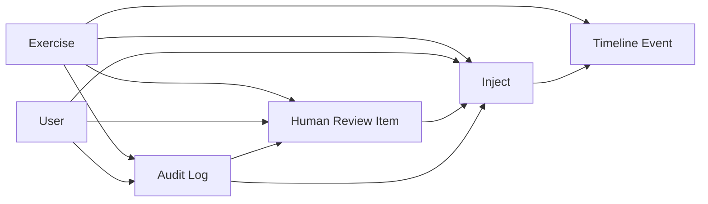

# Forge Studio MVP Foundation

This document explains the first backend foundation for the Forge Studio MVP. It introduces the local domain objects and API module scaffold that future Forge Studio work can build on.

This is not a frontend implementation. It does not add a web server, persistence layer, authentication provider, automatic publishing, external API integration, or live distribution behavior.

## Purpose

The Forge Studio MVP foundation provides a small, typed object layer for the operational records needed by an Exercise Control workspace:

- Exercises
- Users and roles
- Injects
- Timeline events
- Human review items
- Audit logs

The package lives in:

```text
src/project_forge/forge_studio/
```

The API scaffold lives in:

```text
src/project_forge/forge_studio/api/
```

The API scaffold is framework-neutral because the repository does not currently depend on FastAPI or another API framework. The route modules expose route-shaped functions over an in-memory registry so future work can wrap the same behavior with HTTP handlers without changing the domain model.

## Human-In-The-Loop Principle

Human judgment remains authoritative.

Forge Studio may track injects, queue them for review, record decisions, and place approved injects on a timeline. It must not treat an inject as releasable until an explicit human approval is recorded.

Current foundation rule:

```text
Inject.releasable == true only when the inject is approved or scheduled and approved_by is set.
```

Attempting to schedule an inject before approval raises an error. The foundation intentionally does not implement automatic publishing or product release.

## Core Objects

### Exercise

`Exercise` is the top-level MVP workspace container.

Fields:

- `id`
- `name`
- `description`
- `status`
- `phase`
- `start_date`
- `end_date`
- `created_at`
- `updated_at`

Supported status values:

- `draft`
- `planning`
- `preparing`
- `active`
- `paused`
- `completed`
- `archived`

Supported phase values:

- `planning`
- `preparation`
- `execution`
- `assessment`

### User

`User` represents a human Forge Studio operator.

Fields:

- `id`
- `display_name`
- `email`
- `role`
- `organization`
- `status`

Supported roles:

- `exercise_director`
- `intelligence_chief`
- `exercise_control_officer`
- `controller`
- `observer`
- `reviewer`
- `administrator`

Supported status values:

- `active`
- `inactive`

### Inject

`Inject` represents a planned or active Exercise Control inject.

Fields:

- `id`
- `exercise_id`
- `title`
- `description`
- `inject_type`
- `priority`
- `status`
- `assigned_controller`
- `scheduled_time`
- `created_by`
- `approved_by`
- `created_at`
- `updated_at`

Supported statuses:

- `draft`
- `pending_review`
- `approved`
- `rejected`
- `scheduled`
- `cancelled`

Approval behavior:

- Draft or rejected injects can be submitted for review.
- Review approval sets `approved_by` and moves the inject to `approved`.
- Review rejection clears `approved_by` and moves the inject to `rejected`.
- Scheduling requires explicit approval.

### Timeline Event

`TimelineEvent` records an item on the exercise operational timeline.

Fields:

- `id`
- `exercise_id`
- `event_type`
- `title`
- `description`
- `timestamp`
- `source`
- `related_inject_id`

Timeline events can reference injects but do not publish them.

### Human Review Queue Item

`StudioReviewItem` represents a human review task for an inject, product, timeline event, or note.

Fields:

- `id`
- `exercise_id`
- `item_type`
- `item_id`
- `status`
- `reviewer_id`
- `decision`
- `comments`
- `created_at`
- `reviewed_at`

Supported statuses:

- `pending`
- `in_review`
- `approved`
- `rejected`
- `revision_requested`

Supported decisions:

- `approved`
- `rejected`
- `revision_requested`

### Audit Log

`AuditLog` records a traceable Studio action.

Fields:

- `id`
- `exercise_id`
- `actor_id`
- `action`
- `target_type`
- `target_id`
- `timestamp`
- `metadata`

Audit metadata is a dictionary so future workflows can attach stage IDs, correlation IDs, source references, decision context, or UI activity context without changing the model immediately.

## Object Relationships



Relationship rules:

- Injects, timeline events, review items, and audit logs must belong to an exercise.
- Inject authors, assigned controllers, approvers, reviewers, and audit actors are represented by user IDs.
- Review approval can approve an inject, but scheduling remains a separate action.
- Audit logs record actions and target objects but do not mutate those targets.

## API Module Purpose

The API scaffold is organized by object family.

| Module | Purpose |
| --- | --- |
| `api.exercises` | Create, list, get, and transition exercise status or phase. |
| `api.users` | Create, list, and get Studio users. |
| `api.injects` | Create, list, get, submit for review, and schedule injects. |
| `api.timeline` | Create, list, and get timeline events. |
| `api.review` | Create, list, get, approve, and reject review items. |
| `api.audit` | Create, list, and get audit log records. |

These modules should be treated as route-level boundaries, not production HTTP handlers. Future FastAPI or other web framework code can call these functions from actual routes.

## Registry

`ForgeStudioRegistry` is the in-memory object registry for MVP tests and future local demos.

It supports:

- Registration and lookup for all MVP objects.
- Exercise-scoped listing for injects, timeline events, review items, and audit logs.
- Relationship validation for exercise, user, inject, review, and audit references.
- Review approval and rejection helpers that update review items and inject approval state.

It intentionally does not support:

- Database persistence.
- Authentication.
- Network APIs.
- Automatic publishing.
- Background workers.
- Real distribution.

## Future Direction

Future Forge Studio work can build from this foundation by adding:

- Persistent repositories.
- HTTP route adapters.
- Request and response schemas.
- Role-based authorization using the Security Service.
- UI workflows.
- Search indexing.
- Audit Service integration.
- Metrics integration.
- Product and distribution workflow integration after human approval gates are mature.
