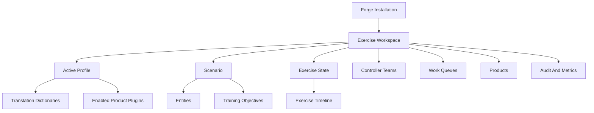
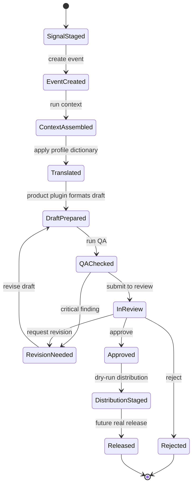
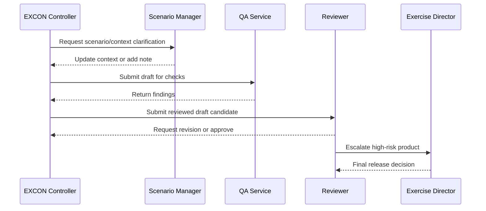
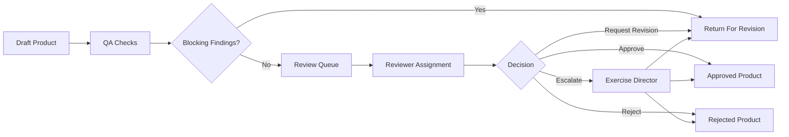
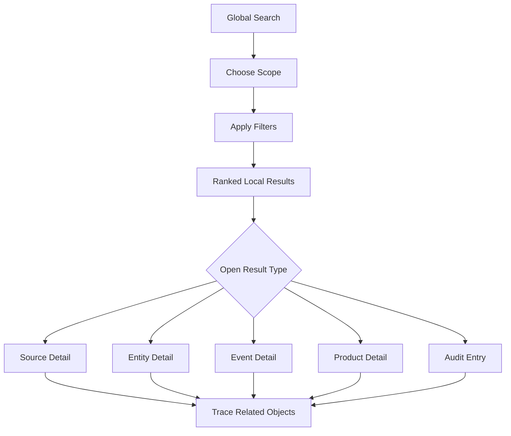
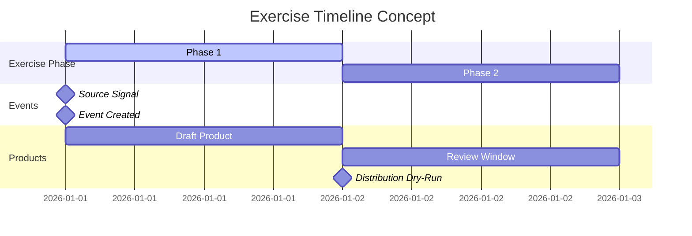

# Forge Studio UX Blueprint

Forge Studio is the future desktop application for Project Forge. It should give Exercise Control teams a calm, auditable operating surface for transforming real-world signals into scenario-consistent exercise products through deterministic services, bounded reasoning support, QA, review, and controlled distribution.

This document is a design specification only. It does not define a frontend implementation, component library, routing framework, backend API, authentication provider, or deployment model.

## Design Objectives

- Make controller work faster without reducing human release authority.
- Keep real-world source material visibly separate from exercise-world truth.
- Make every draft product traceable from source signal through context, translation, QA, review, and distribution.
- Let each controller role see the work that matters to them without hiding audit history or scenario constraints.
- Support desktop-first EXCON operations while remaining usable on tablets and smaller screens for review and awareness.
- Prepare a future React application with clear screens, navigation, state needs, and interaction contracts.

## Product Principles

| Principle | UX Meaning |
| --- | --- |
| Controller authority | Approval, rejection, revision, and release actions must be explicit and attributable. |
| Scenario-first context | Screens should lead with exercise day, phase, scenario, active profile, and control measures. |
| Traceability by default | Source, service stage, QA finding, reviewer decision, and audit metadata should be one click away. |
| Work queue clarity | Controllers should immediately understand what is new, blocked, urgent, approved, or released. |
| Role-shaped density | Administrators need configuration depth; controllers need fast scanning, assignment, and action. |
| Deterministic trust | Show what Forge checked, translated, decided, and did not do. |
| Calm enterprise posture | Use restrained visual hierarchy, dense layouts, strong tables, clear status markers, and minimal decorative UI. |

## User Personas

| Persona | Primary Need | UX Priorities |
| --- | --- | --- |
| Exercise Director | Maintain control of exercise tempo, escalation, and release authority. | Command dashboard, approval gates, timeline, risk indicators, metrics snapshot. |
| EXCON Controller | Convert signals and events into useful exercise injects and products. | Intake queue, context view, product drafting workflow, QA findings, review handoff. |
| Intelligence Controller | Build intelligence products that preserve scenario fidelity and source traceability. | Knowledge lookup, entity lookup, product plugins, translation results, confidence notes. |
| Media Controller | Prepare controlled media, social, and public information products. | Media product templates, fiction boundary warnings, release calendar, review queue. |
| Reviewer | Check drafts for correctness, policy, quality, and exercise safety. | Side-by-side review, QA findings, comments, approval/rejection actions, audit trail. |
| Scenario Manager | Maintain scenario facts, entities, assumptions, constraints, and exercise state. | Scenario registry, entity catalog, timeline editor, state controls, change history. |
| Platform Administrator | Configure services, profiles, plugins, roles, and operational settings. | Service health, configuration registry, RBAC, plugin governance, audit and metrics. |
| Observer Or Leadership Viewer | Monitor exercise production without editing controlled artifacts. | Read-only dashboards, product status, timeline, activity feed, metrics. |

## User Roles

Forge Studio should map UI capabilities to the Security Service role model.

| Role | Intended UI Access |
| --- | --- |
| administrator | Full workspace, configuration, security, profile, plugin, audit, and service settings access. |
| exercise_director | Exercise command dashboard, timeline control, high-risk approvals, review override, release visibility. |
| excon_controller | Intake, event creation, context assembly, product drafting, QA routing, review queue participation. |
| intelligence_controller | Intelligence products, knowledge/entity/scenario lookup, translation review, source traceability. |
| media_controller | Media and social products, narrative calendar, public information review, release staging. |
| reviewer | Assigned review items, comments, QA findings, approval/rejection/revision actions. |
| viewer | Read-only dashboards, activity feed, search, approved products, and timeline. |
| system | Non-human service actor shown only in audit, stage execution, and automation records. |

Permission prompts should explain denied actions without exposing hidden controls. Example: "You can view this product, but approval requires reviewer or exercise director permission."

## Workspace Model

Forge Studio should organize work by workspace. A workspace represents one exercise operating environment, not a personal dashboard.



Workspace header should always expose:

- Exercise name
- Exercise day and phase
- Active profile
- Current tempo and escalation
- Review queue count
- Critical QA count
- Last pipeline execution status

## Controllers

Controllers are role-bearing users operating inside a workspace. The UI should treat controller identity as operational context, not merely account metadata.

Controller cards should show:

- Name and role
- Current desk or cell
- Assigned work items
- Review authority
- Availability state
- Recent decisions
- Escalation permissions

Controller handoff should support:

- Reassign draft product
- Request review
- Request scenario clarification
- Escalate to exercise director
- Leave audit-ready note

## Navigation Hierarchy

Forge Studio should use persistent left navigation with a top command/status bar. The application should avoid marketing-style landing pages; the first screen should be the active workspace dashboard.

```text
Workspace Dashboard
├── Intake
│   ├── Signals
│   ├── Integration Dry-Runs
│   └── Source Artifacts
├── Exercise Picture
│   ├── Scenario
│   ├── Entities
│   ├── Events
│   ├── Knowledge
│   └── Timeline
├── Production
│   ├── Draft Products
│   ├── Product Plugins
│   ├── Translation
│   └── AI Reasoning Stub
├── Quality And Review
│   ├── QA Findings
│   ├── Review Queue
│   ├── Decisions
│   └── Distribution Dry-Runs
├── Operations
│   ├── Pipelines
│   ├── Workflows
│   ├── Automation
│   ├── Search
│   ├── Activity Feed
│   ├── Audit Log
│   └── Metrics
└── Administration
    ├── Profiles
    ├── Plugins
    ├── Configuration
    ├── Security
    └── Service Registry
```

Top command/status bar:

- Workspace selector
- Global search
- Exercise day/phase indicator
- Active profile selector
- Notifications
- Current user menu
- Quick create menu for signal, event, product, review note

## Dashboard Layouts

### Exercise Director Dashboard

```text
+--------------------------------------------------------------------------------+
| Workspace / Day / Phase / Profile                         Search  Alerts  User |
+----------------------+----------------------+----------------------+------------+
| Exercise State       | Review Pressure      | Product Throughput   | Risk Flags |
| Day, phase, tempo    | Pending, overdue     | Draft, QA, approved  | QA, leak   |
+----------------------+----------------------+----------------------+------------+
| Timeline                                  | High Priority Review Queue          |
| Active events, upcoming injects          | Product, owner, risk, action         |
|                                          |                                      |
+------------------------------------------+--------------------------------------+
| Activity Feed                            | Metrics Snapshot                     |
| Decisions, stage runs, comments          | Pipeline, QA, search, distribution   |
+------------------------------------------+--------------------------------------+
```

### Controller Workbench

```text
+--------------------------------------------------------------------------------+
| Current Work Item: Signal/Event/Product                         Stage Status    |
+------------------------------+------------------------------+------------------+
| Source And Event             | Scenario Context             | Actions          |
| Original signal              | Scenario facts               | Create event     |
| Source metadata              | Entities and knowledge       | Run translation  |
| Integration dry-run result   | Decision results             | Draft product    |
+------------------------------+------------------------------+------------------+
| Product Draft                                | QA Findings / Review Notes         |
| Template output, source refs, metadata       | Missing fields, warnings, comments |
+----------------------------------------------+------------------------------------+
```

### Reviewer Dashboard

```text
+--------------------------------------------------------------------------------+
| Review Queue Filters: Assigned / Priority / Product Type / QA Severity          |
+-----------------------------+--------------------------------------------------+
| Queue                       | Review Detail                                    |
| Product title               | Draft product                                    |
| Owner, status, age          | Source references                                |
| QA status, severity         | Scenario references                              |
|                             | Comments and decision controls                   |
+-----------------------------+--------------------------------------------------+
| Audit Trail                 | Decision Panel                                   |
| Stage history and comments  | Approve / Reject / Request Revision / Escalate   |
+-----------------------------+--------------------------------------------------+
```

### Administrator Dashboard

```text
+--------------------------------------------------------------------------------+
| Service Registry  Configuration  Profiles  Plugins  Security  Audit  Metrics    |
+-----------------------------+-----------------------------+--------------------+
| Service Status              | Configuration Changes       | Security Decisions |
| Enabled services            | Scope, key, actor, time     | Allow/deny records |
+-----------------------------+-----------------------------+--------------------+
| Profile Governance          | Plugin Governance           | System Activity    |
| Active profile, versions    | Product plugin status       | Audit sessions     |
+-----------------------------+-----------------------------+--------------------+
```

## Screen Layout Specifications

### Workspace Dashboard

Purpose: Provide the operational picture for the active exercise.

Primary regions:

- Exercise state summary
- Review queue pressure
- Active timeline
- High priority products
- Recent activity
- Metrics snapshot
- Critical alerts

Required interactions:

- Open high-priority work item
- Filter by controller cell
- Jump to timeline event
- Acknowledge notification
- Export visible metrics snapshot in future implementation

### Intake Screen

Purpose: Represent source signals and integration dry-runs without live collection.

Primary regions:

- Source list with type, status, time, owner, and dry-run state
- Signal detail panel
- Source metadata and references
- Integration result and audit log
- Create event action

Empty state: "No source signals are staged for this workspace."

### Scenario Screen

Purpose: Display approved scenario facts, assumptions, constraints, objectives, and control measures.

Primary regions:

- Scenario summary
- Objectives and constraints
- Assumptions
- Control measures
- Linked entities and events
- Change history

Interaction pattern: read-heavy, edit-gated, audit-visible.

### Entity Screen

Purpose: Support lookup of scenario actors, units, organizations, locations, platforms, and relationships.

Primary regions:

- Entity catalog table
- Relationship graph
- Aliases and translation mappings
- Related events and products
- Scenario status and affiliation

### Event Screen

Purpose: Create and manage exercise events derived from source signals or controller input.

Primary regions:

- Event metadata
- Severity, type, source, and status
- Related entities and locations
- Decision Engine results
- Timeline placement
- Downstream products

### Product Draft Screen

Purpose: Prepare controlled product candidates through product plugins.

Primary regions:

- Product type and plugin version
- Required context checklist
- Draft content
- Source references
- Scenario references
- Translation result
- AI reasoning stub metadata
- QA status
- Submit for review action

Draft content should never appear detached from context and source traceability.

### QA Findings Screen

Purpose: Explain deterministic quality checks before review.

Primary regions:

- QA status summary
- Findings grouped by severity
- Required metadata checklist
- Source traceability check
- Fiction boundary check
- Confidence warnings
- Link to affected product fields

### Review Queue Screen

Purpose: Hold products for human controller review before release.

Primary regions:

- Queue table
- Assignment and priority filters
- Product preview
- QA findings
- Review comments
- Decision controls
- Audit history

Decision controls:

- Approve
- Reject
- Request revision
- Escalate
- Reassign
- Add note

### Distribution Screen

Purpose: Represent approved output handling after review.

Primary regions:

- Approved product list
- Distribution target
- Channel status
- Dry-run result
- Local artifact metadata
- Audit log

No UI should imply real email, SharePoint, Teams, or external delivery until those integrations exist and are explicitly enabled.

### Search Screen

Purpose: Provide deterministic discovery across local Forge indexes.

Primary regions:

- Query input
- Scope filters
- Service filters
- Tag and metadata filters
- Date filters
- Result list
- Result preview
- Trace links

Search scopes should include:

- All
- Sources
- Knowledge
- Scenario
- Entities
- Events
- Products
- Reviews
- Audit

### Timeline Screen

Purpose: Show exercise chronology, active events, product release timing, and upcoming controller actions.

Primary regions:

- Exercise day selector
- Phase lane
- Event lane
- Product lane
- Review lane
- Distribution lane
- Activity markers

Timeline items should expose:

- Event type
- Scenario phase
- Related products
- Approval status
- Control measures
- Audit links

### Activity Feed

Purpose: Provide a human-readable stream of significant workspace actions.

Feed item anatomy:

- Actor
- Action
- Target
- Time
- Status
- Severity
- Correlation ID
- Links to audit entry and affected artifact

Activity should be filterable by service, actor, severity, product, event, and time.

### Notifications

Purpose: Alert users to actionable work without becoming a noisy log mirror.

Notification categories:

- Review assignment
- Approval required
- Revision requested
- QA critical finding
- Escalation required
- Pipeline failure
- Distribution dry-run failure
- Configuration/profile change
- Security denial

Notification states:

- New
- Acknowledged
- Snoozed
- Resolved

Notification anatomy:

- Clear title
- Action required
- Related workspace object
- Severity
- Time
- Responsible role
- Primary action

## Product Lifecycle



Lifecycle statuses should be visible in lists and detail views. A product must not skip QA or review in normal controller workflows.

## Controller Interactions



Interaction rules:

- Every comment should attach to a product, event, source, or review item.
- Reassignment should preserve the previous owner and reason.
- Escalation should require an explicit note.
- Approval should require QA status visibility.
- Rejection should require a reason.

## Review Workflow



Review screen requirements:

- Side-by-side source/context/product view
- Persistent QA findings panel
- Comment threads with timestamps and actor identity
- Visible plugin, profile, and translation version
- Clear final action buttons
- Audit trail attached to every decision

## Search Workflow



Search should support fast keyboard use:

- Focus search from the command bar.
- Use arrow keys to move through results.
- Press Enter to open.
- Preserve filters between searches in the same workspace.

## Exercise Timeline

Timeline should be a first-class controller tool, not a decorative chart.



Timeline controls:

- Filter by exercise day
- Filter by product type
- Filter by controller cell
- Show or hide audit markers
- Jump to now
- Compare planned vs actual product timing

## Notification System

Notification severity should use consistent language:

| Severity | Meaning | Example |
| --- | --- | --- |
| Critical | Immediate action needed to preserve exercise safety or release control. | Critical QA leakage finding. |
| High | Important controller action required soon. | Review item awaiting exercise director approval. |
| Normal | Routine task or status change. | Product assigned for review. |
| Low | Informational update. | Metrics snapshot generated. |

Notification delivery surfaces:

- Command bar bell
- Dashboard alert strip
- Activity feed item
- Object-level badge
- Optional future desktop notification

## Activity Feed

Activity feed should synthesize Audit Service, Metrics Service, Pipeline Orchestrator, Workflow Engine, Review Queue, QA Service, and Distribution Service events into readable operational updates.

Example feed items:

- "System ran pipeline stage Translation Engine for Product INT-SUM-004."
- "Reviewer requested revision on Spot Report due to missing source reference."
- "Exercise Director approved News Article draft for dry-run distribution."
- "Security denied viewer attempt to approve Review Item REV-102."

The feed should avoid exposing raw logs by default. Raw audit entries should remain available from each feed item.

## Mobile Considerations

Forge Studio is desktop-first, but responsive behavior should support leadership awareness and urgent review on tablets or phones.

Mobile priorities:

- Read dashboard status
- Search
- View timeline
- Review assigned products
- Comment
- Approve, reject, or request revision when permitted
- Acknowledge notifications

Mobile constraints:

- Avoid dense multi-pane editing on small screens.
- Collapse context, source, QA, and audit panels into tabs.
- Keep primary action fixed near the bottom of detail screens.
- Require confirmation for approval, rejection, escalation, and distribution actions.
- Preserve readable tables through card-style condensed rows.

## Accessibility Considerations

Forge Studio should meet WCAG 2.2 AA expectations for the future React application.

Requirements:

- Full keyboard navigation for global search, tables, queues, comments, dialogs, and decision controls.
- Visible focus states on every interactive element.
- Color must not be the only status indicator; pair color with text, icon, or shape.
- Status labels should be plain language: "Approved", "Needs Revision", "QA Failed", not color-only dots.
- Tables should have persistent headers, clear column names, and sortable state announcements.
- Modal dialogs should trap focus and return focus to the invoking control.
- Critical actions should include accessible confirmation text.
- Charts and timelines should have equivalent table/list views.
- Notifications should be announced through an accessible live region without interrupting typing.
- Product and review text should support zoom and reflow without overlap.
- All icon-only controls should have accessible names and tooltips.

## React Application Design Notes

Future implementation should favor a predictable enterprise application structure:

- App shell with persistent navigation and command bar
- Workspace-scoped route state
- Role-aware action availability
- Service-backed view models rather than UI-specific hidden business logic
- Tables for queues, registries, search, audit, and metrics
- Split panes for detail workflows
- Drawer or side panel for audit, metadata, QA findings, and comments
- Toasts for transient confirmations, notifications for persistent tasks
- Optimistic UI only for reversible local actions; approval/release actions should confirm after service response

Suggested route groups:

```text
/workspaces/:workspaceId
/workspaces/:workspaceId/intake
/workspaces/:workspaceId/scenario
/workspaces/:workspaceId/entities
/workspaces/:workspaceId/events
/workspaces/:workspaceId/timeline
/workspaces/:workspaceId/products
/workspaces/:workspaceId/products/:productId
/workspaces/:workspaceId/qa
/workspaces/:workspaceId/review
/workspaces/:workspaceId/review/:reviewId
/workspaces/:workspaceId/search
/workspaces/:workspaceId/activity
/workspaces/:workspaceId/audit
/workspaces/:workspaceId/metrics
/workspaces/:workspaceId/admin
```

## Design Open Questions

- Should Forge Studio support multiple simultaneous workspaces in one window, or one active workspace at a time?
- Which review actions require two-person control in future production exercises?
- Should comments be threaded globally or scoped only to products, events, and review items?
- Should search results include draft product content by default, or require an explicit product scope?
- What level of offline export is needed for leadership briefs before real distribution integrations exist?
- Which timeline changes require exercise director approval?

## Sprint 001 Deliverable Summary

Forge Studio should be designed as a controller workbench over Forge Core, not as a standalone content editor. The primary UX is a workspace-centered, role-aware, review-driven desktop application where intake, context, translation, product drafting, QA, review, distribution dry-runs, audit, metrics, search, and timeline awareness remain visibly connected.

The future React application should begin with the workspace dashboard, controller workbench, review queue, product detail, search, and timeline screens because those screens carry the main operational loop from signal to scenario-safe product.
