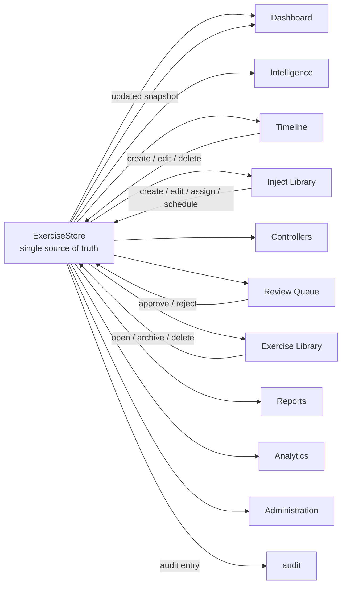

# Forge Studio Web MVP

Forge Studio Web MVP is the first runnable local application for Forge Studio. It proves the platform architecture by connecting the Forge Studio MVP domain models to a small web interface with mock operational data.

This is intentionally minimal. It does not implement authentication, persistence, frontend build tooling, automatic publishing, external APIs, or every Forge Studio feature.

The current sprint introduces interactive CRUD workflows on top of the Forge Studio Exercise Data Engine. The active exercise is the single source of truth for dashboard metrics, timeline events, injects, products, controllers, review queue items, audit records, and exercise statistics.

Forge Studio now uses the shared design system primitives in `src/project_forge/forge_studio/static/design-system/components.js`. These helpers keep buttons, cards, status chips, timeline cards, controller cards, product rows, notifications, empty states, and skeleton loaders consistent across the static MVP.

The current shell also establishes the permanent Forge Studio hierarchy:

```text
Forge -> Organization -> Exercise -> Workspace
```

Every workspace is rendered in the context of the selected organization and exercise.

## Start Locally

From the repository root:

```bash
python -m project_forge.forge_studio.web_app
```

Then open:

```text
http://127.0.0.1:8765
```

Optional host and port:

```bash
python -m project_forge.forge_studio.web_app --host 127.0.0.1 --port 8787
```

## Active Exercise

The interactive demo revolves around one active exercise:

| Field | Value |
| --- | --- |
| Exercise | Mountain Exercise 3-27 |
| Status | ACTIVE |
| Phase | EXECUTE |
| Start | 0800 |
| Exercise Director | Col Smith |
| Exercise Control | Bridgeport EXCON |

## What It Shows

The app displays:

- Forge logo and title
- Primary slogan: Every Event. Every Inject. Every Exercise.
- Dark Forge command-center theme
- Orange accents
- Responsive sidebar navigation
- Dashboard backed by Forge Studio MVP mock data
- Exercise Workspace page
- Operational Timeline page
- Inject Library page
- Controller cards
- Review Queue mock approval workflow
- Exercise Library product repository
- Audit history page
- Settings cards
- Interactive creation, editing, archival, deletion, approval, assignment, and scheduling actions

Navigation sections:

- Mission Control
- Timeline
- Intelligence
- Inject Library
- Exercise Library
- Controllers
- Review Queue
- Reports
- Analytics
- Administration

## Exercise Data Engine

`project_forge.forge_studio.data_engine.ExerciseStore` is the shared application state service for the runnable MVP. It wraps the existing Forge Studio registry and owns the complete active exercise picture:

- Organizations
- Organization-scoped exercises
- Exercise
- Timeline events
- Injects
- Products
- Controllers
- Review queue
- Audit log
- Statistics
- Latest activity feed
- Exercise workspace metadata

The local web server creates one `ExerciseStore` when it starts. Every page asks for the same exercise snapshot instead of constructing local mock objects. Organization and exercise switching are local in-memory commands that load a different exercise context from the same store.



### Single Source of Truth

The active Exercise object anchors all page data. Inject status, review decisions, timeline totals, product counts, controller status, activity records, and audit entries are calculated or retrieved from `ExerciseStore`.

### Application State

The MVP remains in-memory and deterministic. There is no database, browser storage, background worker, or external API. State lasts for the life of the local server process.

### Shared Data

The server exposes the shared state through:

```text
GET /api/exercise
GET /api/dashboard
POST /api/action
POST /api/review/approve
POST /api/review/reject
```

`GET /api/dashboard` is retained as a compatibility alias for the same exercise snapshot.

`POST /api/action` is the interactive command endpoint. It accepts:

```json
{
  "action": "inject.create",
  "payload": {
    "title": "Route Closure",
    "assigned_controller": "user-controller"
  }
}
```

The endpoint returns a refreshed exercise snapshot after the command is applied.

### Event-Driven Updates

Forge Studio uses a command-and-snapshot pattern for the MVP. UI controls submit a named action to `ExerciseStore.apply_action()`. The store mutates the authoritative in-memory exercise state, creates an audit record, updates the activity feed, recalculates statistics, and returns a new snapshot.

This is event-driven in application behavior even though it is intentionally local and synchronous. Future implementations can replace the in-memory command handler with durable events, persistence, and websocket updates without changing the central rule: exercise data changes flow through the Exercise Data Engine first.

### State Synchronization

Pages do not own independent copies of exercise data. After each CRUD command, the browser replaces its local snapshot with the server response and re-renders the active page. This keeps Dashboard, Timeline, Inject Library, Controllers, Review Queue, Exercise Library, and Audit synchronized.

### Propagation

Review and CRUD actions mutate the shared store. After a command, the returned snapshot updates:

- Dashboard pending review count
- Inject Library status and approver
- Review Queue decision and timestamp
- Timeline event ordering
- Controller assignment counts
- Exercise Library product status and counts
- Latest Activity Feed
- Audit History

This gives the MVP one platform behavior model instead of independent page-level mock data.

### Human Review Principle

Forge continues to preserve human release authority. The Review Queue is a mock workflow, but it still requires an explicit approve or reject action. Approval updates the linked inject; rejection prevents it from being treated as releasable. No automatic publishing or distribution is implemented.

## Interactive Workflows

The runnable MVP now supports local CRUD operations through existing applications:

- Exercises: create, edit, duplicate, archive, and delete exercise records.
- Inject Library: create, edit, delete, approve, reject, assign controller, and schedule injects.
- Timeline: add, edit, and delete timeline events. Events sort chronologically.
- Review Queue: approve, reject, and return items for revision.
- Exercise Library: open products, view metadata, view version history, archive, and delete products.
- Audit: displays every command recorded by the Exercise Data Engine.

All operations are local mock actions. They do not publish injects, send email, call external APIs, scrape web content, or persist to a database.

## Design System Runtime

The static app loads `/design-system/components.js` before `/app.js` so application pages can render through shared `ForgeUI` primitives instead of page-specific HTML fragments. The current runtime supports:

- Buttons: primary, secondary, danger, success, warning, ghost, and icon variants
- Cards: information, controller, timeline, product row, statistics, and review-oriented layouts
- Status badges: draft, pending review, approved, scheduled, active, completed, archived, rejected, and workflow variants
- Notifications: success, warning, info, and error
- Operational support components: timeline cards, activity rows, empty states, and skeleton loaders

The full implementation guidance is documented in [design_system/README.md](design_system/README.md). The original long-form visual specification remains in [FORGE_STUDIO_DESIGN_SYSTEM.md](FORGE_STUDIO_DESIGN_SYSTEM.md).

## Workspace Framework

The full workspace framework is documented in [FORGE_STUDIO_WORKSPACE_FRAMEWORK.md](FORGE_STUDIO_WORKSPACE_FRAMEWORK.md).

The shell provides:

- Persistent global header
- Organization selector
- Exercise selector
- Current workspace title
- Exercise status indicator
- Global search modal
- Notification and user menu placeholders
- Collapsible workspace sidebar
- Breadcrumbs in the form `Forge / Organization / Exercise / Workspace`
- `Ctrl+K` / `Cmd+K` command palette framework

Mock organizations:

- Marine Corps Mountain Warfare Training Center
- Expeditionary Operations Training Group
- Marine Corps Warfighting Laboratory
- Training and Education Command
- Joint Training Environment

## Exercise Workspace Concept

The Exercise Workspace is the primary operating surface for a single active exercise. It gathers exercise overview, objectives, participating units, phase, timeline status, exercise director, training audience, and statistics into one controller-facing page.

The workspace is not a personal dashboard. It is the shared operational context for Exercise Control. Future Forge Studio features should treat this workspace as the anchor for injects, timeline events, controller activity, review queues, products, audit records, and after-action material.

## Dashboard Data

The dashboard uses `project_forge.forge_studio.data_engine.create_mock_exercise_store()` to create the shared active exercise state from Forge Studio MVP domain models and local demo data.

Dashboard metrics:

- Active Exercise
- Exercise Status
- Exercise Phase
- Pending Reviews
- Open Injects
- Products Generated
- Timeline Summary
- Controller Count
- Current Operational Time
- Latest Activity Feed
- Completed Injects
- Exercise Duration

## Review Queue

The Review Queue page displays every review item in the active exercise. It shows pending, in-review, approved, and rejected states, along with decision, reviewer, timestamp, and mock approval buttons.

Approving, rejecting, or returning an item for revision records an audit entry and returns a refreshed exercise snapshot. For inject review items, the linked inject status is updated through the existing Forge Studio registry review methods.

## Audit History

The Audit page displays timestamp, actor, action, target, and result for exercise operations. Initial mock audit entries are loaded with the exercise, and every mock review operation appends a new audit record.

## Exercise Library Philosophy

The Exercise Library replaces the generic Reports placeholder. It is the historical repository for every product generated during the exercise.

The library organizes generated material into folders:

- Intelligence
- Injects
- Media
- Weather
- Reports
- Maps
- Photos
- Video
- Documents
- Exports

Each product record shows product type, title, status, version, last updated time, author, and review status. The library should eventually become the authoritative exercise archive for retrieval, assessment, export, and after-action review.

The primary read endpoint is:

```text
GET /api/dashboard
```

The primary command endpoint is:

```text
POST /api/action
```

The endpoint is served by the local stdlib web server in:

```text
src/project_forge/forge_studio/web_app.py
```

## Structure

```text
src/project_forge/forge_studio/
├── data_engine.py
├── mock_data.py
├── web_app.py
└── static/
    ├── index.html
    ├── styles.css
    └── app.js
```

## Design Direction

The interface follows the Forge design language:

- Dark theme
- Graphite and steel surfaces
- Orange Forge accents
- Dense operational cards
- Sidebar navigation
- No consumer-style landing page
- No decorative UI that competes with exercise data

## Boundaries

Current boundaries:

- No frontend framework
- No npm dependency
- No authentication
- No database
- No automatic publishing
- No real distribution
- No external network calls
- No live AI provider calls

The application is a runnable proof of architecture, not the final Forge Studio product.

## Future Work

Future sprints can add:

- Real route adapters
- Persistent storage
- Role-based authorization
- Editable exercise records
- Timeline interactions
- Inject library workflows
- Review queue actions
- Audit log views
- Metrics and health panels
- React or another frontend framework if the project adopts one
