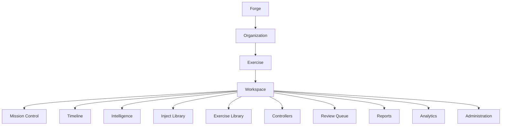

# Forge Studio Workspace Framework

Forge Studio now follows a permanent platform hierarchy:

```text
Forge
-> Organization
-> Exercise
-> Workspace
```

Every screen is rendered inside a selected Organization, selected Exercise, and selected Workspace. This makes Forge Studio a multi-organization, multi-exercise platform rather than a collection of independent pages.

## Platform Hierarchy



## Organization Model

Organizations represent the owning command, training venue, lab, or joint environment. The current local MVP uses deterministic mock organizations:

- Marine Corps Mountain Warfare Training Center
- Expeditionary Operations Training Group
- Marine Corps Warfighting Laboratory
- Training and Education Command
- Joint Training Environment

Each organization owns one or more exercises. Switching organization updates the exercise selector and selects that organization's active or highest-priority exercise.

## Exercise Workspace Model

The Exercise remains the single source of truth. The Exercise Data Engine owns the selected exercise's:

- Timeline events
- Injects
- Products
- Controllers
- Review queue
- Audit log
- Statistics
- Activity feed
- Workspace metadata

Changing the active exercise reloads these data sets through the same `ExerciseStore` snapshot used by all workspaces.

## Navigation Philosophy

Forge Studio uses persistent navigation:

- Global header: application name, organization selector, exercise selector, current workspace, exercise status, search, notifications, and user menu.
- Left sidebar: permanent workspace list with active state, icons, and collapse support.
- Breadcrumbs: `Forge / Organization / Exercise / Workspace`.

The first screen is Mission Control. Forge Studio should never require users to pass through a marketing or landing page before reaching operational context.

## Workspace Philosophy

Workspaces are views into the selected Exercise, not separate applications with independent state.

| Workspace | Purpose |
| --- | --- |
| Mission Control | Real-time operational picture and exercise health. |
| Timeline | Chronological exercise events and controller updates. |
| Intelligence | Intelligence picture, source traceability, and product recommendations. |
| Inject Library | Human-reviewed inject creation, assignment, scheduling, and status. |
| Exercise Library | Products, exports, and exercise archive material. |
| Controllers | Controller assignments, status, workload, and review pressure. |
| Review Queue | Human approval, rejection, and revision workflow. |
| Reports | Reporting framework for controller and after-action products. |
| Analytics | Exercise metrics derived from the data engine. |
| Administration | Organization, users, plugins, integrations, audit, and platform settings. |

## Command Palette Vision

The command palette is opened with `Ctrl+K` or `Cmd+K`. The current MVP provides a searchable modal framework with placeholder commands:

- Create Exercise
- Create Inject
- Open Timeline
- Approve Review
- Search Products
- Search Controllers
- Open Mission Control
- Settings

Future implementation should route commands through permission-aware handlers and preserve audit records for state-changing actions.

## Global Search Vision

Global search is scoped to the selected organization and exercise. The current MVP returns realistic mock results for:

- Exercises
- Injects
- Products
- Controllers
- Timeline
- Reports
- Intelligence

Future search should integrate the Forge Search Service while preserving local deterministic behavior in tests.

## Human Review Principle

Exercise switching does not bypass review authority. Injects and products remain scoped to their exercise, and review actions still require explicit user action before anything is treated as approved or releasable.
