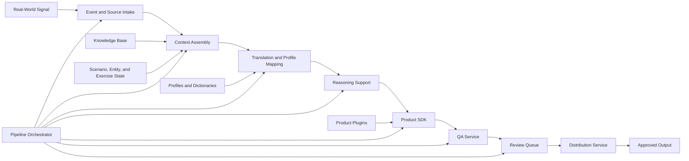

# Project Forge Platform

## High-Level Architecture

Project Forge is organized as a modular platform. Each service owns a narrow responsibility, exposes typed local models, and can be tested independently before being composed into workflows and pipelines.

The current implementation is a local foundation. It contains importable Python packages, deterministic validators, loaders, registries, integration source definitions, product plugin definitions, workflow foundations, a review queue foundation, a distribution service foundation, a storage service foundation, a search service foundation, an audit service foundation, a metrics service foundation, a configuration service foundation, and a pipeline orchestrator. Production services, live external integrations, user interfaces, and real publishing integrations remain future work.

## Platform Layers

### 1. Source And Event Layer

This layer represents real-world signals and exercise events. It preserves what happened, where the information came from, and how the signal should be treated inside the exercise.

Primary services:

- Integration Service
- Event Engine
- Core source models
- Future source intake adapters

### 2. Scenario Context Layer

This layer maintains the exercise world. It provides the facts, assumptions, constraints, entities, current state, and knowledge references needed to reason about a product.

Primary services:

- Knowledge Engine
- Scenario Engine
- Entity Engine
- Exercise State Engine
- Context Engine
- Decision Engine

### 3. Translation And Profile Layer

This layer maps real-world terminology into exercise terminology. It supports exercise profiles, translation dictionaries, country mappings, unit mappings, location mappings, and other controlled substitutions.

Primary services:

- Translation Engine
- Profile Manager
- Profile definitions
- Translation dictionaries
- Country and actor mappings

### 4. Reasoning And Preparation Layer

This layer prepares controlled reasoning inputs and future AI-assisted drafting requests. The current AI Reasoning Engine builds deterministic prompts and provider interfaces only; it does not perform live API calls.

Primary services:

- AI Reasoning Engine
- Prompt registry
- Offline provider interfaces
- Decision Engine

### 5. Product Layer

This layer defines product types, templates, formatting rules, plugin discovery, and required context. It prepares product outputs but should remain separate from release authority.

Primary services:

- Product SDK
- Product plugins
- Product formatter
- Product registry

### 6. Quality And Review Layer

This layer checks whether a prepared product is complete, scenario-safe, source-backed, and ready for controller review.

Primary services:

- QA Service
- Review Queue
- Distribution Service
- Storage Service
- Future approval and release controls

### 7. Orchestration Layer

This layer coordinates services into repeatable workflows and pipelines. It records execution status, logs, metadata, and failure state.

Primary services:

- Automation Service
- Workflow Engine
- Pipeline Orchestrator
- Search Service
- Audit Service
- Metrics Service
- Configuration Service
- Security Service

## Data Flow

The platform data flow follows a controlled path:

1. A real-world signal or exercise event is represented as structured input. The Integration Service can define and dry-run source collection while preserving validation and audit metadata.
2. The Context Engine assembles scenario state, entities, events, knowledge, and decision context.
3. The Translation Engine applies profile-specific dictionaries and mappings.
4. The AI Reasoning Engine prepares bounded reasoning context or prompt material.
5. The Product SDK selects product definitions and templates.
6. The QA Service validates required metadata, source references, confidence, and fiction boundaries.
7. The Review Queue receives the prepared product for human controller action.
8. Approved products can later be handled by the Distribution Service through local, dry-run, or placeholder channels, while the Storage Service provides controlled local artifact access, listing, metadata, and archive behavior.
9. The Search Service can provide ranked local discovery across configured service indexes without external APIs or semantic/vector search.
10. The Audit Service can record significant actions, correlation IDs, parent/child events, severity, tags, and metadata for traceability and after-action review.
11. The Metrics Service can collect local counters, gauges, timers, histogram placeholders, snapshots, and reports for health, performance, and exercise analytics.
12. The Configuration Service can load and resolve local settings across platform, service, profile, workflow, plugin, environment, and user scopes.
13. The Security Service can evaluate local role-based access decisions for users, service accounts, and system actors while preserving audit-ready allow/deny records.

## Core Concepts

### Scenario Fidelity

Every product must conform to the exercise world, current timeline, approved entities, assumptions, constraints, and training objectives.

### Human Release Authority

Forge may assist with preparation, validation, translation, and drafting, but EXCON remains responsible for approving what enters play.

### Source Traceability

Products should retain enough source context to explain why they exist and how real-world material influenced notional exercise content.

### Integrations

Integrations describe where source material can come from and which local connector type would handle it. The current foundation validates configuration, supports dry-run collection, and records audit metadata without scraping websites, reading email, calling APIs, or connecting to collaboration platforms.

### Profiles

A profile packages exercise-specific assumptions, translation rules, country mappings, preferred product types, and control boundaries.

### Plugins

Plugins define reusable product capabilities. A product plugin describes metadata, product type, required context, supported formats, and templates.

### Workflows

Workflows are deterministic ordered steps for preparing a class of work, such as daily summaries or breaking news injects.

### Pipelines

Pipelines coordinate platform services end to end. The current example pipeline moves from Real World Event to Context, Translation, AI Reasoning, Product SDK, QA, and Review Queue.

### Review Queue

The review queue is the human control point where products are held for editorial review, approval, rejection, or correction before release.

### Distribution

Distribution handles approved product outputs after human review. The foundation supports local file/archive outputs, dry-run execution, audit metadata, and placeholders for future document and collaboration channels without calling external services.

### Storage

Storage provides a common abstraction over project artifact folders. The foundation supports local filesystem, output, archive, knowledge base, and template folders, plus placeholder cloud and collaboration providers, while preserving path validation and audit metadata.

### Search

Search provides a unified discovery interface across Forge services. The current foundation supports deterministic exact, partial, tag, metadata, date, service, relevance, and pagination behavior over local indexes, with semantic, vector, and hybrid search reserved for future implementation.

### Audit

Audit records significant actions across the platform. The current foundation supports in-memory events, actors, actions, categories, sessions, correlation IDs, parent/child relationships, severity, tags, metadata, and filtering without persistent storage or database connections.

### Metrics And Observability

Metrics and observability provide local insight into platform health, throughput, and exercise activity. The current foundation supports counters, gauges, timers, histogram placeholders, tags, metadata, snapshots, collectors, and reports without visualization or external monitoring systems.

### Configuration

Configuration provides central local settings management. The current foundation supports YAML and JSON loading, default values, deterministic override precedence, required field validation, environment variable placeholders, metadata, audit-ready change records, and registry lookup without secret managers, network calls, or databases.

### Security

Security provides local authorization foundations for the platform. The current foundation supports principals, roles, permissions, policies, security contexts, allow/deny decisions, validation, default Forge roles, metadata, and audit-ready decision records without real authentication, CAC integration, external identity providers, credential storage, or network calls.
