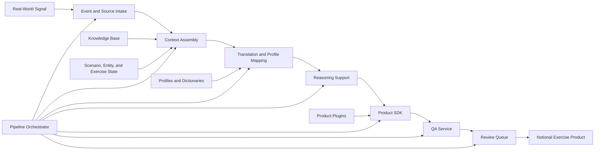

# Project Forge Platform

## High-Level Architecture

Project Forge is organized as a modular platform. Each service owns a narrow responsibility, exposes typed local models, and can be tested independently before being composed into workflows and pipelines.

The current implementation is a local foundation. It contains importable Python packages, deterministic validators, loaders, registries, product plugin definitions, workflow foundations, a review queue foundation, and a pipeline orchestrator. Production services, external integrations, user interfaces, and report export surfaces remain future work.

## Platform Layers

### 1. Source And Event Layer

This layer represents real-world signals and exercise events. It preserves what happened, where the information came from, and how the signal should be treated inside the exercise.

Primary services:

- Event Engine
- Core source models
- Future source intake adapters

### 2. Scenario Context Layer

This layer maintains the exercise world. It provides the facts, assumptions, constraints, entities, current state, and knowledge references needed to reason about a product.

Primary services:

- Knowledge Engine
- Scenario Engine
- Entity Engine
- Exercise State Engine
- Context Engine
- Decision Engine

### 3. Translation And Profile Layer

This layer maps real-world terminology into exercise terminology. It supports exercise profiles, translation dictionaries, country mappings, unit mappings, location mappings, and other controlled substitutions.

Primary services:

- Translation Engine
- Profile Manager
- Profile definitions
- Translation dictionaries
- Country and actor mappings

### 4. Reasoning And Preparation Layer

This layer prepares controlled reasoning inputs and future AI-assisted drafting requests. The current AI Reasoning Engine builds deterministic prompts and provider interfaces only; it does not perform live API calls.

Primary services:

- AI Reasoning Engine
- Prompt registry
- Offline provider interfaces
- Decision Engine

### 5. Product Layer

This layer defines product types, templates, formatting rules, plugin discovery, and required context. It prepares product outputs but should remain separate from release authority.

Primary services:

- Product SDK
- Product plugins
- Product formatter
- Product registry

### 6. Quality And Review Layer

This layer checks whether a prepared product is complete, scenario-safe, source-backed, and ready for controller review.

Primary services:

- QA Service
- Review Queue
- Future approval and release controls

### 7. Orchestration Layer

This layer coordinates services into repeatable workflows and pipelines. It records execution status, logs, metadata, and failure state.

Primary services:

- Workflow Engine
- Pipeline Orchestrator

## Data Flow

The platform data flow follows a controlled path:

1. A real-world signal or exercise event is represented as structured input.
2. The Context Engine assembles scenario state, entities, events, knowledge, and decision context.
3. The Translation Engine applies profile-specific dictionaries and mappings.
4. The AI Reasoning Engine prepares bounded reasoning context or prompt material.
5. The Product SDK selects product definitions and templates.
6. The QA Service validates required metadata, source references, confidence, and fiction boundaries.
7. The Review Queue receives the prepared product for human controller action.
8. Approved products can later be exported or released through future output services.

## Core Concepts

### Scenario Fidelity

Every product must conform to the exercise world, current timeline, approved entities, assumptions, constraints, and training objectives.

### Human Release Authority

Forge may assist with preparation, validation, translation, and drafting, but EXCON remains responsible for approving what enters play.

### Source Traceability

Products should retain enough source context to explain why they exist and how real-world material influenced notional exercise content.

### Profiles

A profile packages exercise-specific assumptions, translation rules, country mappings, preferred product types, and control boundaries.

### Plugins

Plugins define reusable product capabilities. A product plugin describes metadata, product type, required context, supported formats, and templates.

### Workflows

Workflows are deterministic ordered steps for preparing a class of work, such as daily summaries or breaking news injects.

### Pipelines

Pipelines coordinate platform services end to end. The current example pipeline moves from Real World Event to Context, Translation, AI Reasoning, Product SDK, QA, and Review Queue.

### Review Queue

The review queue is the human control point where products are held for editorial review, approval, rejection, or correction before release.
