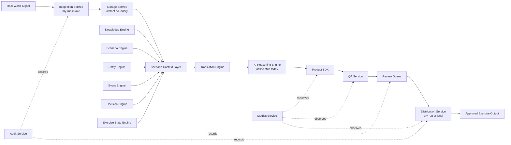
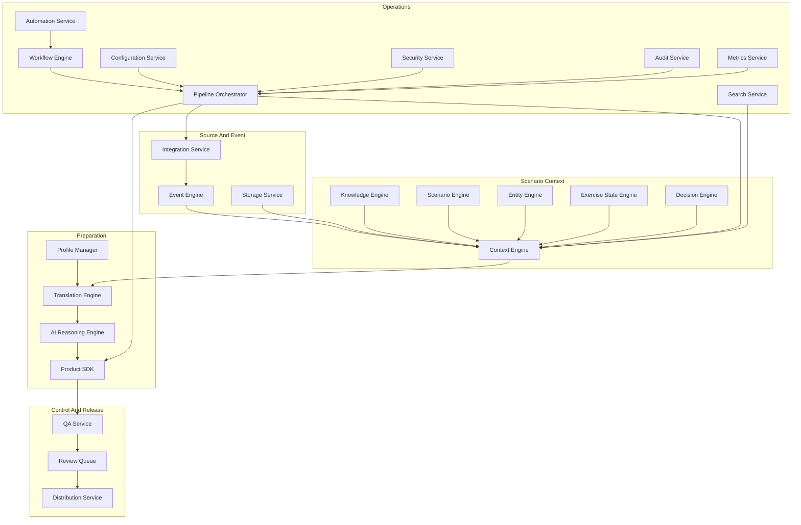

# Forge

<p align="center">
  
</p>

<p align="center">
  <strong>Every Event.<br>Every Inject.<br>Every Exercise.</strong>
</p>

<p align="center">
  <a href="pyproject.toml"></a>
  <a href="LICENSE"></a>
  <a href="tests"></a>
  <a href="WORKFLOWS.md"></a>
  <a href="SECURITY.md"></a>
</p>

Forge is a modular Exercise Intelligence and Control Platform designed to transform real-world information into scenario-consistent training products through deterministic services, AI-assisted reasoning, and human-controlled workflows.

Forge gives Exercise Control teams a disciplined path from signal to scenario-safe product: source context, scenario grounding, translation, reasoning support, quality checks, human review, dry-run distribution, audit traceability, and operational metrics.

## Mission

Forge exists to help Exercise Control teams rapidly convert fast-moving real-world signals into credible, notional exercise products while preserving scenario fidelity, source traceability, editorial control, and clear fiction boundaries.

The platform is built around one operational question:

> What would this real-world signal look like inside our exercise world?

## Vision

Forge is intended to become the control framework for AI-assisted exercise production. It separates intake, scenario context, deterministic translation, bounded reasoning, product preparation, quality assurance, review authority, distribution handling, audit logging, metrics, configuration, automation, and security into explicit platform services.

The desired end state is faster controller production, stronger scenario discipline, reusable exercise profiles, governed product plugins, and auditable workflows that leadership, controllers, and developers can understand.

## Core Principles

| Principle | Meaning |
| --- | --- |
| Scenario fidelity first | Products must conform to approved exercise facts, entities, timelines, assumptions, constraints, and objectives. |
| Human release authority | Forge can assist preparation, validation, and drafting, but controllers remain the approval authority. |
| Deterministic foundations | Local services validate, transform, and route data predictably before any future live integrations are introduced. |
| Source traceability | Products retain enough source, context, and transformation metadata to explain why they exist. |
| Clear fiction boundaries | Real-world material and notional exercise truth remain visibly separated. |
| Modular service design | Each capability owns a narrow responsibility and can be tested independently. |
| Audit-ready operations | Decisions, reviews, distributions, configurations, and workflow execution are structured for after-action review. |

## Platform Architecture





## Domains

Forge is organized into operational domains that map to controller workflows and software ownership boundaries.

| Domain | Purpose | Primary Modules |
| --- | --- | --- |
| Source and event intake | Represent signals, dry-run integrations, source metadata, and exercise events. | Integration Service, Event Engine, Storage Service |
| Scenario context | Maintain exercise truth, current state, entities, knowledge, and decision inputs. | Knowledge Engine, Scenario Engine, Entity Engine, Exercise State Engine, Decision Engine, Context Engine |
| Translation and profiles | Adapt real-world terminology into controlled exercise language. | Profile Manager, Translation Engine |
| Reasoning and product preparation | Build bounded reasoning requests and format draft products from validated context. | AI Reasoning Engine, Product SDK |
| Quality and review | Validate products and hold them for human control before release. | QA Service, Review Queue, Distribution Service |
| Platform operations | Coordinate, observe, search, audit, configure, automate, and secure local workflows. | Pipeline Orchestrator, Workflow Engine, Automation Service, Search Service, Audit Service, Metrics Service, Configuration Service, Security Service |

## Services

| Service | Responsibility | Status |
| --- | --- | --- |
| Core Models | Shared source, scenario, report, review, and quality containers. | Implemented foundation |
| Integration Service | Source definitions, connector registration, validation, dry-run collection, and audit metadata. | Implemented foundation |
| Knowledge Engine | Local knowledge document indexing and references. | Implemented foundation |
| Scenario Engine | Scenario facts, assumptions, constraints, objectives, control measures, status, and tempo. | Implemented foundation |
| Entity Engine | Exercise organizations, units, installations, individuals, platforms, capabilities, and relationships. | Implemented foundation |
| Event Engine | Exercise events, severity, impacts, status, entities, locations, and source references. | Implemented foundation |
| Exercise State Engine | Current phase, exercise day, tempo, escalation, and situation state. | Implemented foundation |
| Context Engine | Deterministic context snapshots across scenario, state, entities, events, decisions, and knowledge. | Implemented foundation |
| Decision Engine | Deterministic rules for escalation, training objective relevance, duplicates, and consistency. | Implemented foundation |
| Profile Manager | Exercise profiles that select services, plugins, dictionaries, workflows, and paths. | Implemented foundation |
| Translation Engine | Deterministic dictionaries, aliases, regex rules, profiles, and translation results. | Implemented foundation |
| AI Reasoning Engine | Prompt building and provider interfaces with offline stub support and no live API calls. | Implemented foundation |
| Product SDK | Product plugin loading, discovery, validation, registry support, and deterministic formatting. | Implemented foundation |
| QA Service | Required metadata checks, source traceability, confidence warnings, and leakage checks. | Implemented foundation |
| Review Queue | Human review items, assignment, approval, rejection, revisions, notes, and audit history. | Implemented foundation |
| Distribution Service | Approved-output handling with dry-run, local, archive, and placeholder channels. | Implemented foundation |
| Storage Service | Local and placeholder storage providers, metadata reads, dry-run writes, listing, and archive handling. | Implemented foundation |
| Search Service | Deterministic local search indexes, filters, ranking, pagination, and future semantic capability declarations. | Implemented foundation |
| Audit Service | In-memory audit events, sessions, categories, actions, severities, tags, metadata, and filtering. | Implemented foundation |
| Metrics Service | Counters, gauges, timers, snapshots, reports, collectors, tags, and standard operational metrics. | Implemented foundation |
| Configuration Service | YAML/JSON settings, scopes, profiles, defaults, precedence, env placeholders, and change records. | Implemented foundation |
| Automation Service | Schedule, manual, event, workflow, and conditional trigger recording without external schedulers. | Implemented foundation |
| Security Service | Principals, roles, permissions, policies, RBAC decisions, validation, and audit-ready records. | Implemented foundation |
| Demo Pipeline | End-to-end sample workflow across implemented local services. | Implemented foundation |
| Workflow Engine | Ordered local workflow definitions, conditions, retries, execution logs, and results. | Implemented foundation |
| Pipeline Orchestrator | Ordered service pipelines with stage results, context propagation, metadata, logs, and failure handling. | Implemented foundation |

For service-level inputs, outputs, dependencies, and boundaries, see [SERVICES.md](SERVICES.md).

## Forge Modules

Forge modules are the future packaging boundary for reusable operational capability.

| Module Type | Intent | Current Position |
| --- | --- | --- |
| Source modules | Normalize source families such as public releases, controller notes, social narratives, or local files. | Placeholder |
| Profile modules | Package exercise environment rules, scenario mappings, terminology, and product preferences. | Placeholder |
| Product modules | Provide governed product definitions, templates, required context, and output formats. | Product SDK foundation exists |
| QA modules | Add venue-specific, scenario-specific, or product-specific validation checks. | Placeholder |
| Export modules | Produce approved outputs in document, briefing, markdown, text, or archive formats. | Placeholder |
| Provider modules | Wrap approved AI or offline reasoning providers behind common interfaces. | Provider interface foundation exists |
| Workflow modules | Package reusable controller workflows for daily summaries, injects, white cell products, and reporting sequences. | Workflow foundation exists |

## Profiles

Profiles adapt Forge to a training venue, exercise family, unit, or operating environment without modifying Forge Core.

Current profile foundations support:

- Profile identifier, display name, owner, version, and metadata
- Enabled services and plugins
- Knowledge base, template, translation dictionary, and workflow paths
- Default scenario selection
- Profile components for dictionaries, templates, workflows, and future controlled artifacts

Example profile direction includes MWTC, ITX, and Joint Exercise environments. Profile governance should treat country mappings, actor mappings, escalation boundaries, and release rules as controlled exercise policy.

See [PROFILES.md](PROFILES.md) for profile concepts, MWTC direction, translation dictionaries, country mappings, and governance notes.

## Plugins

Plugins define reusable product capabilities without hard-coding every report family into the core platform.

Current product plugin examples include:

- Intelligence Summary
- Intelligence Information Report
- Social Media
- News Article
- Spot Report

Each product plugin declares metadata, product type, required context, supported formats, templates, required fields, ownership, version, and governance metadata. Plugins are deterministic, reviewable, and designed to remain behind QA and human review.

See [PLUGINS.md](PLUGINS.md) and [`config/product_plugins/`](config/product_plugins/) for the current plugin model and examples.

## Run The Demo

Forge includes a full local demonstration pipeline that exercises the completed foundation architecture without external calls.

```bash
python3 -m venv .venv
source .venv/bin/activate
python -m pip install -e ".[dev]"
python -m project_forge.demo_pipeline
```

Expected result:

```text
Pipeline: forge-core-demo
Status: succeeded
- sample-real-world-event: succeeded (source_intake)
- integration-dry-run: succeeded (integration_service)
- storage: succeeded (storage_service)
- knowledge-lookup: succeeded (knowledge_engine)
- scenario-lookup: succeeded (scenario_engine)
- entity-lookup: succeeded (entity_engine)
- event-creation: succeeded (event_engine)
- decision-engine: succeeded (decision_engine)
- context-engine: succeeded (context_engine)
- translation-engine: succeeded (translation_engine)
- ai-reasoning-stub: succeeded (ai_reasoning_engine)
- product-sdk: succeeded (product_sdk)
- qa-service: succeeded (qa_service)
- review-queue: succeeded (review_queue)
- distribution-dry-run: succeeded (distribution_service)
- audit-log: succeeded (audit_service)
- metrics-snapshot: succeeded (metrics_service)
```

The demo uses repository sample data, dry-run handlers, and the offline AI stub provider. It does not call external APIs, invoke OpenAI, send email, scrape websites, or publish products.

## Roadmap

| Phase | Focus |
| --- | --- |
| Phase 0: Foundation | Repository structure, documentation, package layout, test scaffold, local service foundations, and current demo pipeline. |
| Phase 1: First Capability | Define the first controller-facing workflow, strengthen sample data, and make end-to-end behavior easier to operate. |
| Phase 2: Quality Baseline | Expand automated tests, add linting and formatting commands, type checking, and meaningful CI checks. |
| Phase 3: Operations | Define release processes, generated-output retention, runbook procedures, and runtime observability guidance. |
| Future Product Growth | Add production-grade user interfaces, persistent storage, approved integrations, richer export support, and governed provider modules. |

See [ROADMAP.md](ROADMAP.md) for the lightweight roadmap and [WORKFLOWS.md](WORKFLOWS.md) for workflow direction.

## Current Status

Forge is a local, deterministic platform foundation. The repository now contains typed domain models, service registries, validators, loaders, sample configuration, product plugins, and an end-to-end demo pipeline.

Current boundaries:

- No real OpenAI or live AI provider calls
- No web scraping
- No email, SharePoint, Teams, or social media access
- No external identity provider or CAC integration
- No persistent database
- No automatic release of products into exercise play

The platform is ready for iterative capability growth while preserving controller authority, scenario fidelity, and auditability.

## Repository Layout

```text
.
├── assets/                # Logo and static project assets
├── config/                # Safe sample configuration, profiles, workflows, dictionaries, plugins
├── knowledge_base/        # Durable exercise knowledge references
├── outputs/               # Local generated artifacts, ignored except placeholders
├── src/project_forge/     # Forge Python package and service foundations
├── tests/                 # Unit and integration tests mirroring package structure
├── ARCHITECTURE.md        # Design boundaries and architecture notes
├── PLATFORM.md            # Platform layers, data flow, and core concepts
├── SERVICES.md            # Service responsibilities and boundaries
├── WORKFLOWS.md           # Workflow philosophy and demo pipeline
├── PROFILES.md            # Profile model and governance
├── PLUGINS.md             # Product SDK and plugin model
├── DEVELOPMENT.md         # Coding, testing, milestone, and contribution standards
├── SETUP.md               # Local setup and validation commands
├── RUNBOOK.md             # Operational maintenance notes
├── SECURITY.md            # Security reporting and sensitive-data guidance
├── CHANGELOG.md           # Human-readable change history
└── pyproject.toml         # Python project metadata and tooling configuration
```

## Documentation

| Document | Purpose |
| --- | --- |
| [VISION.md](VISION.md) | Executive vision, problem statement, goals, non-goals, and EXCON benefits. |
| [PLATFORM.md](PLATFORM.md) | Platform layers, architecture, data flow, and core concepts. |
| [SERVICES.md](SERVICES.md) | Service responsibilities, inputs, outputs, dependencies, status, and boundaries. |
| [ARCHITECTURE.md](ARCHITECTURE.md) | Architecture notes and foundation design boundaries. |
| [WORKFLOWS.md](WORKFLOWS.md) | Workflow philosophy, demo pipeline, and future workflow direction. |
| [PROFILES.md](PROFILES.md) | Profile concepts, MWTC direction, dictionaries, mappings, and governance. |
| [PLUGINS.md](PLUGINS.md) | Product SDK, plugin architecture, report plugins, and future plugin types. |
| [DEVELOPMENT.md](DEVELOPMENT.md) | Coding standards, test standards, ticket conventions, and review expectations. |
| [SETUP.md](SETUP.md) | Local development setup and validation commands. |
| [RUNBOOK.md](RUNBOOK.md) | Maintainer operations and future incident/release placeholders. |
| [SECURITY.md](SECURITY.md) | Vulnerability reporting and sensitive-data handling. |
| [CHANGELOG.md](CHANGELOG.md) | Notable changes. |

## Contributing

Forge is built for disciplined, reviewable platform growth.

Recommended workflow:

1. Read the relevant repository documentation.
2. Keep changes focused on a single service boundary or workflow.
3. Add focused tests for behavior changes.
4. Preserve deterministic local behavior and avoid hidden external calls.
5. Update documentation when architecture, services, workflows, configuration, profiles, plugins, or operations change.
6. Run the test suite before handoff.

```bash
python -m pytest
```

See [CONTRIBUTING.md](CONTRIBUTING.md) and [DEVELOPMENT.md](DEVELOPMENT.md) for expectations.

## License

Forge is released under the [MIT License](LICENSE).
