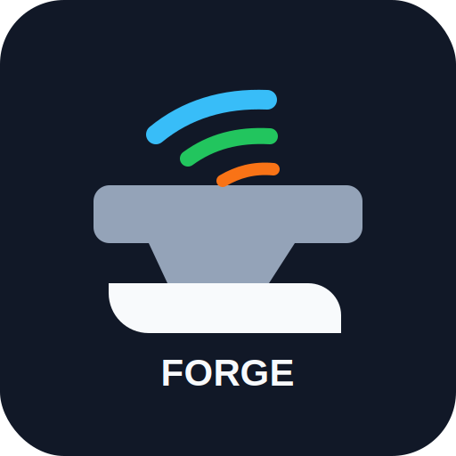
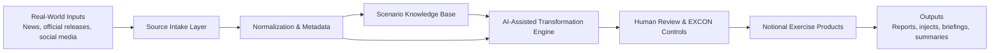

# Project Forge

<!-- Logo placeholder: replace with final branding when available. -->
<p align="center">
  
</p>

<p align="center">
  <strong>AI-assisted EXCON reporting for scenario-consistent exercise products.</strong>
</p>

Project Forge is an AI-assisted Exercise Control (EXCON) reporting engine designed to transform real-world news, official releases, and social media signals into notional exercise products that remain consistent with an established scenario knowledge base.

The project is currently in its initial framework stage. This repository contains the professional open-source skeleton, documentation structure, package layout, configuration placeholders, and CI scaffold needed to support future implementation.

## Mission

Project Forge exists to help EXCON teams rapidly produce credible, scenario-aligned reporting products from fast-moving open-source information while preserving exercise fiction, source traceability, editorial control, and operational discipline.

Forge should help operators answer a practical question:

> What would this real-world signal look like if it occurred inside our exercise scenario?

## Intended Product Model

Project Forge will ingest or reference real-world source material, compare it against a curated exercise knowledge base, and generate notional outputs such as:

- Situation updates
- White cell inject drafts
- Media simulation products
- Official statement simulations
- Social media summaries
- Exercise intelligence notes
- Source traceability packets

All generated products should remain clearly notional, scenario-consistent, and reviewable by human controllers before use.

## Architecture



### Planned Components

- **Source intake layer**: Collects or accepts real-world source material for transformation.
- **Integration service**: Defines, validates, and dry-runs external and internal source connectors without performing external collection.
- **Normalization and metadata**: Preserves source context, timestamps, provenance, and confidence notes.
- **Scenario knowledge base**: Stores exercise facts, fictional entities, constraints, terminology, timelines, and editorial rules.
- **AI-assisted transformation engine**: Converts source material into scenario-consistent notional drafts.
- **Human review controls**: Keeps EXCON staff in charge of approval, release, and correction.
- **Distribution service**: Handles approved product outputs after human review through local and placeholder channels.
- **Automation service**: Records schedule, manual, event, workflow, and conditional triggers without external schedulers.
- **Review queue**: Holds prepared products for human approval, rejection, or revision before release.
- **Pipeline orchestrator**: Coordinates local Project Forge services into ordered, auditable workflows.

## Forge Principles

- **Scenario fidelity first**: Generated products must conform to the exercise world, timeline, entities, and approved facts.
- **Human-controlled output**: AI assists drafting and transformation; EXCON staff remain the release authority.
- **Source traceability**: Every notional product should preserve enough source context to explain why it exists.
- **Clear fiction boundaries**: Products must be marked, structured, and handled as exercise material.
- **Operational usefulness**: Outputs should support real controller workflows, not just demonstrate model capability.
- **Modular design**: Intake, knowledge base handling, transformation, review, and export should remain separable.
- **Auditable evolution**: Scenario assumptions, prompts, configurations, and generated products should be reviewable over time.

## Repository Layout

```text
.
├── .github/workflows/     # GitHub Actions workflow definitions and CI scaffolding.
├── assets/                # Static assets such as logos, templates, and reference media.
├── config/                # Safe example configuration and future runtime settings.
├── knowledge_base/        # Scenario facts, assumptions, references, and durable context.
├── outputs/               # Generated local exercise products; ignored by Git by default.
├── src/project_forge/     # Python package source code.
├── tests/                 # Automated tests mirroring the package structure.
├── ARCHITECTURE.md        # Design boundaries and future architecture notes.
├── CHANGELOG.md           # Human-readable project change history.
├── CONTRIBUTING.md        # Contribution expectations and development workflow.
├── ROADMAP.md             # Project milestones and planned capability growth.
├── RUNBOOK.md             # Operational procedures for maintainers and EXCON use.
├── SECURITY.md            # Security reporting and sensitive data guidance.
├── SETUP.md               # Local development setup instructions.
└── pyproject.toml         # Python project metadata and tooling configuration.
```

## Documentation Map

- [VISION.md](VISION.md): Executive vision, problem statement, goals, non-goals, and EXCON benefits.
- [PLATFORM.md](PLATFORM.md): Platform architecture, layers, data flow, and core concepts.
- [SERVICES.md](SERVICES.md): Service responsibilities, inputs, outputs, dependencies, and maturity.
- [PROFILES.md](PROFILES.md): Profile concept, MWTC profile direction, dictionaries, and country mappings.
- [PLUGINS.md](PLUGINS.md): Product SDK, plugin architecture, report plugins, and future plugin types.
- [WORKFLOWS.md](WORKFLOWS.md): Workflow philosophy, example workflows, and pipeline execution.
- [DEVELOPMENT.md](DEVELOPMENT.md): Coding standards, milestone naming, commit conventions, tickets, and contribution workflow.
- [ARCHITECTURE.md](ARCHITECTURE.md): Current architecture notes and implementation boundaries.
- [ROADMAP.md](ROADMAP.md): Phased capability growth.
- [RUNBOOK.md](RUNBOOK.md): Operational maintenance notes.
- [CONTRIBUTING.md](CONTRIBUTING.md): Contributor expectations.

## Setup Overview

Project Forge is not yet functional, but the local development environment is ready to be extended.

```bash
python3 -m venv .venv
source .venv/bin/activate
python -m pip install --upgrade pip
python -m pip install -e ".[dev]"
```

Validate the current skeleton:

```bash
PYTHONPATH=src python -c "import project_forge; print(project_forge.__name__)"
```

See [SETUP.md](SETUP.md) for the longer setup notes.

## Roadmap

### Phase 0: Foundation

- Establish repository structure, documentation, package metadata, and CI scaffolding.
- Define the initial architecture and EXCON operating assumptions.
- Create safe folders for knowledge base material, configuration, assets, and generated outputs.

### Phase 1: Knowledge Base Model

- Define the scenario knowledge base format.
- Add validation for scenario facts, fictional entities, timelines, and constraints.
- Create examples that distinguish real-world source material from exercise-world truth.

### Phase 2: Source Intake

- Add structured input handling for news articles, official releases, and social media references.
- Preserve source metadata, provenance, timestamps, and analyst notes.
- Add tests for source normalization and validation.

### Phase 3: Transformation Engine

- Implement AI-assisted drafting workflows.
- Enforce scenario consistency checks before output generation.
- Add review prompts and controller-facing editorial controls.

### Phase 4: Product Generation

- Generate notional EXCON products such as situation updates, inject drafts, media summaries, and briefing notes.
- Add export support for common document, slide, spreadsheet, or plain-text formats as needed.
- Store generated artifacts in `outputs/` with traceability metadata.

### Phase 5: Operational Hardening

- Expand automated tests, linting, type checking, and CI coverage.
- Document runbook procedures for exercise use.
- Add release, audit, and configuration management guidance.

## Current Status

Project Forge is a clean project skeleton with typed foundation modules for the primary domain entities and deterministic local service foundations. The README describes the intended system, and the implementation milestone now includes data models for sources, exercise context, scenario entities, report requests, generated reports, review quality checks, an Integration Service for source definitions and dry-run connectors, a Profile Manager for exercise environments, a Review Queue for human release control, a Distribution Service for approved outputs, an Automation Service for local trigger recording, and a Pipeline Orchestrator that can run ordered in-process workflows.

### Integration Service

The `project_forge.integration_service` package provides local source definitions, source type validation, YAML loading, connector registration, dry-run collection, result status, metadata capture, error handling, and audit logs. It supports RSS, website, manual upload, local file, and placeholder source types for email, social media, SharePoint, and APIs without performing scraping, email access, social media access, SharePoint calls, or API calls.

### Profile Manager

The `project_forge.profile_manager` package provides profile metadata, component definitions, registry lookup, YAML loading, and validation for exercise-specific Forge profiles. Profiles select enabled services, enabled plugins, knowledge base paths, template paths, translation dictionary paths, workflow paths, default scenarios, and metadata without modifying Forge Core.

### Review Queue

The `project_forge.review_queue` package provides local review items, ordered review queues, reviewer assignment, approval, rejection, revision requests, notes, timestamps, audit history, registry support, and manager operations. It does not publish products automatically.

### Distribution Service

The `project_forge.distribution_service` package provides approved-output distribution items, channels, targets, requests, results, status tracking, validation, audit logs, dry-run mode, local file/archive handlers, and placeholder channels for future formats and collaboration tools. It does not send email, call SharePoint, call Teams, or use external APIs.

### Automation Service

The `project_forge.automation_service` package provides automation rules, cron schedules, manual triggers, event triggers, workflow triggers, conditional triggers, retry policy, enable/disable controls, execution history, validation, and registry support. It records trigger intent only; it does not run workflows or use external schedulers.

### Pipeline Orchestrator

The `project_forge.pipeline_orchestrator` package provides a local execution foundation for end-to-end workflows. Pipelines register ordered stages dynamically, execute without external APIs, capture execution logs and metadata, stop on stage failure, and expose execution status through `PipelineStatus`.

The included example pipeline demonstrates the intended platform flow:

```text
Real World Event -> Context -> Translation -> AI Reasoning -> Product SDK -> QA -> Review Queue
```
