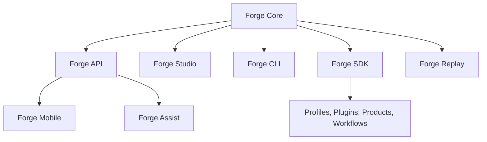

# Forge Ecosystem

Forge is an open-source digital operations platform for modern Exercise Control.

Every Event. Every Inject. Every Exercise.

Human Command. Machine Assistance.

People create training. Forge manages information.

## Ecosystem Overview

The Forge ecosystem is organized around a modular platform model. Each surface has a clear role, and each should preserve human judgment, source traceability, scenario fidelity, and audit-ready workflows.

## Forge Studio

Forge Studio is the command-center application for Exercise Control.

It provides:

- Mission Control.
- Organization and exercise selection.
- Operational timeline.
- Intelligence workspace.
- Inject Library.
- Exercise Library.
- Controller workspaces.
- Review Queue.
- Reports and analytics.
- Administration.

Forge Studio should be the primary workspace for controllers, reviewers, exercise directors, and administrators.

## Forge Core

Forge Core is the deterministic service foundation.

It includes source intake, storage, scenario context, entities, events, exercise state, decisions, translation, product preparation, QA, review, distribution handling, audit, metrics, configuration, automation, search, security, workflow orchestration, and pipeline orchestration.

Forge Core should remain modular, testable, local-first, and clear about boundaries.

## Forge API

Forge API is the future integration layer for applications, automation, approved external systems, and enterprise deployments.

It should expose controlled access to:

- Exercises.
- Organizations.
- Timeline events.
- Injects.
- Products.
- Review queues.
- Audit records.
- Metrics.
- Profiles.
- Plugins.
- Search.

Forge API should enforce permissions, preserve audit records, and avoid bypassing human review authority.

## Forge SDK

Forge SDK is the extension toolkit for Forge.

It should support:

- Product plugins.
- Profile packages.
- Workflow modules.
- QA rules.
- Translation dictionaries.
- Scenario adapters.
- Export adapters.
- Test fixtures for extension authors.

The SDK should make Forge extensible without weakening the core architecture.

## Forge CLI

Forge CLI is the command-line surface for local operators, developers, and maintainers.

It should support:

- Running local demos.
- Validating profiles.
- Testing plugins.
- Inspecting configuration.
- Exporting exercise archives.
- Running dry-run pipelines.
- Managing local development tasks.

The CLI should remain deterministic and safe for offline development.

## Forge Replay

Forge Replay is the future mission reconstruction and after-action surface.

It should allow exercise teams to replay:

- Timeline events.
- Inject flow.
- Product generation.
- Review decisions.
- Audit records.
- Metrics snapshots.
- Controller activity.

Forge Replay should help teams understand what happened, why it happened, and how the exercise workflow can improve.

## Forge Assist

Forge Assist is the bounded AI-assisted controller support layer.

It should help with:

- Draft preparation.
- Scenario translation.
- Product summarization.
- Review support.
- Search refinement.
- Knowledge lookup.
- After-action synthesis.

Forge Assist must remain human-controlled. It should not publish products, release injects, override reviewers, or make command decisions.

## Forge Mobile

Forge Mobile is the future lightweight review and awareness surface.

It should support:

- Review queue awareness.
- Approval status visibility.
- Exercise status snapshots.
- Timeline awareness.
- Notifications.
- Read-only product access.
- Limited, permission-aware review actions where appropriate.

Forge Mobile should complement Forge Studio, not replace the command-center workspace.
