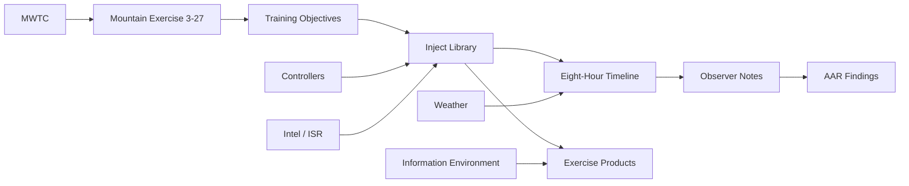

# Project Sentinel

Project Sentinel is the official reference exercise for Forge.

Sentinel is the canonical exercise used for:

- Forge Academy.
- UI demonstrations.
- Development.
- Regression testing.
- Documentation.
- Screenshots.
- Conference demonstrations.
- Future automated testing.

## Exercise Identity

| Field | Value |
| --- | --- |
| Organization | Marine Corps Mountain Warfare Training Center |
| Exercise | Mountain Exercise 3-27 |
| Status | Planning |
| Exercise Director | Colonel Smith |
| Exercise Control | Bridgeport EXCON |
| Training Audience | Infantry Battalion |

## Reference Package

| File | Purpose |
| --- | --- |
| [organization.md](organization.md) | Organization, exercise staff, and operating context. |
| [scenario.md](scenario.md) | Fictional scenario and operational setting. |
| [objectives.md](objectives.md) | Training objectives linked to injects, timeline, controllers, products, and AAR measures. |
| [timeline.md](timeline.md) | Eight-hour operational timeline. |
| [controllers.md](controllers.md) | Controller assignments and responsibilities. |
| [injects.md](injects.md) | Canonical 50-inject library. |
| [intelligence.md](intelligence.md) | Intelligence baseline, ISR collection, and threat picture. |
| [weather.md](weather.md) | Mountain weather forecast and impacts. |
| [products.md](products.md) | Expected products and review expectations. |
| [observations.md](observations.md) | Observer notes and measures. |
| [aar.md](aar.md) | After-action review structure and findings. |

## Knowledge Graph

Sentinel assets should be modeled as connected operational assets:

## Relationship Index

| Relationship | Source Assets | Target Assets | Purpose |
| --- | --- | --- | --- |
| `contains` | Marine Corps Mountain Warfare Training Center | Mountain Exercise 3-27 | Organization owns the exercise. |
| `contains` | Mountain Exercise 3-27 | Objectives, timeline, controllers, injects, products, observations, AAR | Exercise scopes all operational assets. |
| `supports` | Objectives | Injects, products, observations | Training value is traceable to work products and events. |
| `assigned_to` | Injects | Controllers | Every inject has a human owner. |
| `triggers` | Injects | Timeline events, command decisions, products | Injects create exercise activity. |
| `produces` | Injects and timeline events | INTSUM, SPOTREP, Weather Update, Media Summary, Commander Update, Observer Report, Daily Summary | Products derive from exercise activity. |
| `observes` | Observer teams | Timeline events, controller actions, review decisions | Observer evidence connects behavior to objectives. |
| `evaluates` | AAR findings | Objectives and observations | Assessment traces findings back to evidence. |
| `references` | Products and AAR findings | Source injects, timeline events, observations | Archive records remain explainable. |
| `precedes` / `follows` | Timeline events | Follow-on events and decisions | Execution sequence supports Replay and AAR. |
| `related_to` | Intelligence, weather, cyber, media, logistics, medical, civilian activity | Injects and products | Cross-domain relationships show operational context. |

## Regression Baseline

Future features should be validated against Project Sentinel when they affect:

- Exercise workspace behavior.
- Atlas planning.
- Inject creation or review.
- Product generation.
- Knowledge Graph relationships.
- Timeline behavior.
- Controller assignments.
- AAR and archive workflows.

Sentinel should remain safe, fictional, and deterministic.
